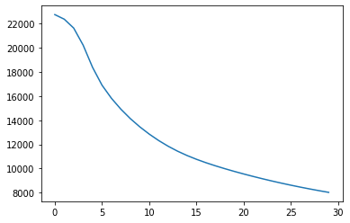
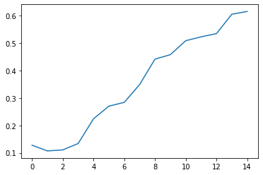

```python
# Amir Pourmand - 99210259
```


```python
# Amir Pourmand (99210259)

import torchvision.datasets as ds
from sklearn.utils import shuffle
import numpy as np
import pandas as pd
import matplotlib.pyplot as plt

data_train = np.array(ds.FashionMNIST(root="./data", train=True, download=True).data)
target_train = np.array(ds.FashionMNIST(root="./data", train=True, download=True).targets)
data_test = np.array(ds.FashionMNIST(root="./data", train=False, download=True).data)
target_test = np.array(ds.FashionMNIST(root="./data", train=False, download=True).targets)

#data_train, target_train = shuffle(data_train, target_train)

#### Transform the data! ####
data_train =data_train / 255
data_test = data_test / 255

target_train=pd.get_dummies(target_train).values
target_test = pd.get_dummies(target_test).values

data_train=data_train.reshape((-1,28*28))
data_test = data_test.reshape((-1,28*28))

```


```python
from IPython.core.debugger import set_trace

```

#Part 1


```python
def show_grid_twobytwo(data):
    my_pic=data[np.random.randint(0,60000,4)]
    fig, axs = plt.subplots(2, 2)
    axs[0, 0].imshow(my_pic[0].reshape(28,28))
    axs[0, 1].imshow(my_pic[1].reshape(28,28))
    axs[1, 0].imshow(my_pic[2].reshape(28,28))
    axs[1, 1].imshow(my_pic[3].reshape(28,28))

show_grid_twobytwo(data_train)
```


    

    


#Part 2


```python
class ReLU():
    def forward(self, x):
        self.old_x = np.copy(x)
        return np.clip(x,0,None)

    def backward(self, grad):
        return np.where(self.old_x>0,grad,0)

class Sigmoid():
    def forward(self, x):
        self.old_y = np.exp(x) / (1. + np.exp(x))
        return self.old_y

    def backward(self, grad):
        return self.old_y * (1. - self.old_y) * grad

class Softmax():
    def forward(self,x):
            self.old_y = np.exp(x) / np.exp(x).sum(axis=1) [:,None]
            return self.old_y

    def backward(self,grad):
            return self.old_y * (grad -(grad * self.old_y).sum(axis=1)[:,None])

class CrossEntropy():
    def forward(self,x,y):
            self.old_x = x.clip(min=1e-8,max=None)
            self.old_y = y
            return (np.where(y==1,-np.log(self.old_x), 0)).sum(axis=1)

    def backward(self):
            return np.where(self.old_y==1,-1/self.old_x, 0)


class Linear():
    def __init__(self,n_in,n_out,momentum=False):
        self.weights = np.random.randn(n_in,n_out) * np.sqrt(2/n_in)
        self.biases = np.zeros(n_out)

        self.momentum = momentum
        if momentum:
            self.grad_w =self.previous = np.zeros((n_in,n_out))

    def forward(self, x):
        self.old_x = x
        return np.dot(x,self.weights) + self.biases

    def backward(self,grad):
        self.grad_b = grad.mean(axis=0)

        if self.momentum:
            self.previous = self.grad_w

        self.grad_w = (np.matmul(self.old_x[:,:,None],grad[:,None,:])).mean(axis=0)
        return np.dot(grad,self.weights.transpose())


```


```python
class Model():
    def __init__(self, layers, cost):
        self.layers = layers
        self.cost = cost

    def forward(self,x):
        for layer in self.layers:
            x = layer.forward(x)
        return x

    def loss(self,x,y):
        self.output = self.forward(x)
        return self.cost.forward(self.output,y)

    def backward(self):
        grad = self.cost.backward()
        for i in range(len(self.layers)-1,-1,-1):
            grad = self.layers[i].backward(grad)

    def calculate_accuracy(self, real):
        predictedNumber = np.argmax(self.output,axis=1)
        realNumber = np.argmax(real,axis=1)
        return np.mean(predictedNumber == realNumber)


def train(model,lr,nb_epoch,data,label,batch_size=1000):
    loss_train = []
    loss_test = []

    accuracy_train = []
    accuracy_test = []
    for epoch in range(nb_epoch):
        lr = lr * 0.99
        if lr < 1e-3:
            lr = 1e-3

        num_inputs = 0
        running_loss = 0
        accuracy = 0

        number_of_batches = int(data.shape[0]/batch_size)
        for i in range(number_of_batches):
            input = data[i*batch_size:(i+1)*batch_size]
            output = label[i*batch_size:(i+1)*batch_size]
            num_inputs += input.shape[0]
            running_loss += model.loss(input,output).sum()
            model.backward()

            accuracy += model.calculate_accuracy(output)

            for layer in model.layers:
                if type(layer) == Linear:
                    layer.weights -= lr * layer.grad_w
                    layer.biases -= lr * layer.grad_b
        print(f'Epoch {epoch+1}/{nb_epoch}: loss train = {running_loss}')
        print(f'Train accuracy: {accuracy/number_of_batches}')

        loss_test_current = model.loss(data_test,target_test).sum()
        print(f'Epoch {epoch+1}/{nb_epoch}: loss test = {loss_test_current}')
        accuracy_current_test= model.calculate_accuracy(target_test)
        print(f'Test accuracy: {accuracy_current_test}')

        loss_train.append(running_loss)
        loss_test.append(loss_test_current)
        
        accuracy_train.append(accuracy/number_of_batches)
        accuracy_test.append(accuracy_current_test)
    return loss_train,loss_test,accuracy_train,accuracy_test
```


```python
net = Model([Linear(784,128), Sigmoid(), Linear(128,64), Sigmoid(), Linear(64,10), Softmax()], CrossEntropy())
```


```python
 epoch_count = 30
 loss_train,loss_test,accuracy_train,accuracy_test = train(net,1e-1,epoch_count,data_train,target_train)
```

    Epoch 1/30: loss train = 132827.31534895362
    Train accuracy: 0.3532333333333334
    Epoch 1/30: loss test = 20946.296056284016
    Test accuracy: 0.4632
    Epoch 2/30: loss train = 117172.60599323544
    Train accuracy: 0.5205333333333333
    Epoch 2/30: loss test = 17953.662677965036
    Test accuracy: 0.5687
    Epoch 3/30: loss train = 98626.18946359388
    Train accuracy: 0.6223333333333333
    Epoch 3/30: loss test = 15075.571274081087
    Test accuracy: 0.66
    Epoch 4/30: loss train = 83943.86310049995
    Train accuracy: 0.6666999999999998
    Epoch 4/30: loss test = 13095.937413259353
    Test accuracy: 0.6757
    Epoch 5/30: loss train = 73973.71860094678
    Train accuracy: 0.6827666666666665
    Epoch 5/30: loss test = 11739.020457773331
    Test accuracy: 0.6895
    Epoch 6/30: loss train = 66933.03985993215
    Train accuracy: 0.6955500000000002
    Epoch 6/30: loss test = 10751.809601783323
    Test accuracy: 0.6981
    Epoch 7/30: loss train = 61667.876132650716
    Train accuracy: 0.7071833333333334
    Epoch 7/30: loss test = 9995.114571604656
    Test accuracy: 0.7081
    Epoch 8/30: loss train = 57547.6836181342
    Train accuracy: 0.7169500000000002
    Epoch 8/30: loss test = 9392.592953102454
    Test accuracy: 0.7145
    Epoch 9/30: loss train = 54219.690978905935
    Train accuracy: 0.7259166666666667
    Epoch 9/30: loss test = 8900.556119154262
    Test accuracy: 0.7213
    Epoch 10/30: loss train = 51476.333175961896
    Train accuracy: 0.7324499999999997
    Epoch 10/30: loss test = 8492.417457977645
    Test accuracy: 0.7266
    Epoch 11/30: loss train = 49186.19135391677
    Train accuracy: 0.7386833333333331
    Epoch 11/30: loss test = 8150.55075674045
    Test accuracy: 0.7305
    Epoch 12/30: loss train = 47258.16462239753
    Train accuracy: 0.74345
    Epoch 12/30: loss test = 7862.141325124827
    Test accuracy: 0.7352
    Epoch 13/30: loss train = 45623.69243591608
    Train accuracy: 0.7477166666666668
    Epoch 13/30: loss test = 7617.196853815864
    Test accuracy: 0.7397
    Epoch 14/30: loss train = 44228.35205687464
    Train accuracy: 0.7510666666666668
    Epoch 14/30: loss test = 7407.643638566689
    Test accuracy: 0.7443
    Epoch 15/30: loss train = 43027.944823165264
    Train accuracy: 0.7541333333333332
    Epoch 15/30: loss test = 7226.9017491708255
    Test accuracy: 0.7486
    Epoch 16/30: loss train = 41986.448992140344
    Train accuracy: 0.7577333333333333
    Epoch 16/30: loss test = 7069.62804951542
    Test accuracy: 0.7513
    Epoch 17/30: loss train = 41074.62375804611
    Train accuracy: 0.7610500000000001
    Epoch 17/30: loss test = 6931.510152426372
    Test accuracy: 0.7538
    Epoch 18/30: loss train = 40268.860103027044
    Train accuracy: 0.7637333333333335
    Epoch 18/30: loss test = 6809.085700227674
    Test accuracy: 0.7569
    Epoch 19/30: loss train = 39550.18896524748
    Train accuracy: 0.7662666666666667
    Epoch 19/30: loss test = 6699.585315690341
    Test accuracy: 0.7591
    Epoch 20/30: loss train = 38903.42894354668
    Train accuracy: 0.7691666666666666
    Epoch 20/30: loss test = 6600.79917734809
    Test accuracy: 0.761
    Epoch 21/30: loss train = 38316.4627883525
    Train accuracy: 0.7717000000000003
    Epoch 21/30: loss test = 6510.965634710272
    Test accuracy: 0.763
    Epoch 22/30: loss train = 37779.63061594186
    Train accuracy: 0.7742500000000001
    Epoch 22/30: loss test = 6428.67942762729
    Test accuracy: 0.7656
    Epoch 23/30: loss train = 37285.2270813171
    Train accuracy: 0.7766166666666667
    Epoch 23/30: loss test = 6352.816926654394
    Test accuracy: 0.7678
    Epoch 24/30: loss train = 36827.09009696092
    Train accuracy: 0.7792333333333338
    Epoch 24/30: loss test = 6282.476002181724
    Test accuracy: 0.7703
    Epoch 25/30: loss train = 36400.26954895911
    Train accuracy: 0.7815499999999999
    Epoch 25/30: loss test = 6216.928352809768
    Test accuracy: 0.7715
    Epoch 26/30: loss train = 36000.76493478377
    Train accuracy: 0.7839000000000002
    Epoch 26/30: loss test = 6155.582225125222
    Test accuracy: 0.7738
    Epoch 27/30: loss train = 35625.32065576926
    Train accuracy: 0.7856333333333333
    Epoch 27/30: loss test = 6097.953503577149
    Test accuracy: 0.7769
    Epoch 28/30: loss train = 35271.26760508346
    Train accuracy: 0.7879166666666667
    Epoch 28/30: loss test = 6043.643295294777
    Test accuracy: 0.7789
    Epoch 29/30: loss train = 34936.400542759235
    Train accuracy: 0.7897666666666665
    Epoch 29/30: loss test = 5992.320432960774
    Test accuracy: 0.7804
    Epoch 30/30: loss train = 34618.88255533996
    Train accuracy: 0.7919833333333334
    Epoch 30/30: loss test = 5943.707690938072
    Test accuracy: 0.7822


```python
plt.plot(np.arange(epoch_count), loss_train)
```


    [<matplotlib.lines.Line2D at 0x7f6f1290e550>]


    

    


```python
plt.plot(np.arange(epoch_count), loss_test)
```


    [<matplotlib.lines.Line2D at 0x7f6f128e6ed0>]


    

    


```python
plt.plot(np.arange(epoch_count), accuracy_train)
```


    [<matplotlib.lines.Line2D at 0x7f6f12856c90>]


    

    


```python
plt.plot(np.arange(epoch_count), accuracy_test)
```


    [<matplotlib.lines.Line2D at 0x7f6f127c3450>]


    

    


# Part 3


```python
net2 = Model([Linear(784,128), ReLU(), Linear(128,64), ReLU(), Linear(64,10), Softmax()], CrossEntropy())
```


```python
 epoch_count = 30
 loss_train,loss_test,accuracy_train,accuracy_test = train(net,1e-1,epoch_count,data_train,target_train)
```

    Epoch 1/30: loss train = 34273.999245328014
    Train accuracy: 0.7943333333333332
    Epoch 1/30: loss test = 5882.024706903974
    Test accuracy: 0.7845
    Epoch 2/30: loss train = 33891.26773555227
    Train accuracy: 0.7967333333333333
    Epoch 2/30: loss test = 5823.962497812203
    Test accuracy: 0.7865
    Epoch 3/30: loss train = 33530.60173532922
    Train accuracy: 0.7998333333333332
    Epoch 3/30: loss test = 5769.388843975354
    Test accuracy: 0.7884
    Epoch 4/30: loss train = 33190.318871548116
    Train accuracy: 0.8021333333333331
    Epoch 4/30: loss test = 5717.999626335039
    Test accuracy: 0.7909
    Epoch 5/30: loss train = 32868.717160099586
    Train accuracy: 0.8039666666666668
    Epoch 5/30: loss test = 5669.53330350921
    Test accuracy: 0.793
    Epoch 6/30: loss train = 32564.331491516987
    Train accuracy: 0.8061499999999999
    Epoch 6/30: loss test = 5623.76092580437
    Test accuracy: 0.7947
    Epoch 7/30: loss train = 32275.88105378048
    Train accuracy: 0.8082166666666668
    Epoch 7/30: loss test = 5580.479400607843
    Test accuracy: 0.7966
    Epoch 8/30: loss train = 32002.23148273933
    Train accuracy: 0.8099833333333335
    Epoch 8/30: loss test = 5539.50667765365
    Test accuracy: 0.7981
    Epoch 9/30: loss train = 31742.367252942953
    Train accuracy: 0.8119666666666666
    Epoch 9/30: loss test = 5500.6782600567085
    Test accuracy: 0.7987
    Epoch 10/30: loss train = 31495.371060447782
    Train accuracy: 0.813816666666667
    Epoch 10/30: loss test = 5463.844607662446
    Test accuracy: 0.8002
    Epoch 11/30: loss train = 31260.40798246758
    Train accuracy: 0.8151333333333333
    Epoch 11/30: loss test = 5428.869133093598
    Test accuracy: 0.8016
    Epoch 12/30: loss train = 31036.71298637588
    Train accuracy: 0.8166833333333335
    Epoch 12/30: loss test = 5395.626598800164
    Test accuracy: 0.8035
    Epoch 13/30: loss train = 30823.580907713233
    Train accuracy: 0.8181833333333334
    Epoch 13/30: loss test = 5364.001799454714
    Test accuracy: 0.805
    Epoch 14/30: loss train = 30620.35836044925
    Train accuracy: 0.8192999999999998
    Epoch 14/30: loss test = 5333.888461616467
    Test accuracy: 0.8055
    Epoch 15/30: loss train = 30426.437234558463
    Train accuracy: 0.820516666666667
    Epoch 15/30: loss test = 5305.1883190221915
    Test accuracy: 0.807
    Epoch 16/30: loss train = 30241.2495282917
    Train accuracy: 0.8218333333333335
    Epoch 16/30: loss test = 5277.8103347078195
    Test accuracy: 0.8079
    Epoch 17/30: loss train = 30064.263299206854
    Train accuracy: 0.823216666666667
    Epoch 17/30: loss test = 5251.670046556537
    Test accuracy: 0.8094
    Epoch 18/30: loss train = 29894.979530694858
    Train accuracy: 0.8239833333333337
    Epoch 18/30: loss test = 5226.689015030968
    Test accuracy: 0.8109
    Epoch 19/30: loss train = 29732.92971884649
    Train accuracy: 0.8248666666666669
    Epoch 19/30: loss test = 5202.794353242951
    Test accuracy: 0.8112
    Epoch 20/30: loss train = 29577.67399753661
    Train accuracy: 0.8257000000000002
    Epoch 20/30: loss test = 5179.918321275403
    Test accuracy: 0.8126
    Epoch 21/30: loss train = 29428.79964011735
    Train accuracy: 0.826533333333333
    Epoch 21/30: loss test = 5157.997969074271
    Test accuracy: 0.8135
    Epoch 22/30: loss train = 29285.91980267913
    Train accuracy: 0.8275833333333334
    Epoch 22/30: loss test = 5136.974815103587
    Test accuracy: 0.8142
    Epoch 23/30: loss train = 29148.672403354012
    Train accuracy: 0.8286333333333337
    Epoch 23/30: loss test = 5116.794550974292
    Test accuracy: 0.8152
    Epoch 24/30: loss train = 29016.719061362473
    Train accuracy: 0.8293833333333336
    Epoch 24/30: loss test = 5097.406765101522
    Test accuracy: 0.8161
    Epoch 25/30: loss train = 28889.74404589522
    Train accuracy: 0.8299833333333335
    Epoch 25/30: loss test = 5078.764680891482
    Test accuracy: 0.8163
    Epoch 26/30: loss train = 28767.453206914564
    Train accuracy: 0.8308833333333336
    Epoch 26/30: loss test = 5060.824906893904
    Test accuracy: 0.8172
    Epoch 27/30: loss train = 28649.572876927738
    Train accuracy: 0.8312833333333335
    Epoch 27/30: loss test = 5043.547197759708
    Test accuracy: 0.8169
    Epoch 28/30: loss train = 28535.848744823237
    Train accuracy: 0.8321999999999999
    Epoch 28/30: loss test = 5026.894225762419
    Test accuracy: 0.817
    Epoch 29/30: loss train = 28426.044710542068
    Train accuracy: 0.8330000000000002
    Epoch 29/30: loss test = 5010.831363159079
    Test accuracy: 0.8176
    Epoch 30/30: loss train = 28319.941733479172
    Train accuracy: 0.8335833333333335
    Epoch 30/30: loss test = 4995.326475878811
    Test accuracy: 0.818


```python
plt.plot(np.arange(epoch_count), loss_train)
```


    [<matplotlib.lines.Line2D at 0x7f6f12764c10>]


    

    


```python
plt.plot(np.arange(epoch_count), loss_test)
```


    [<matplotlib.lines.Line2D at 0x7f6f126d4d10>]


    

    


```python
plt.plot(np.arange(epoch_count), accuracy_train)
```


    [<matplotlib.lines.Line2D at 0x7f6f1263d690>]


    

    


```python
plt.plot(np.arange(epoch_count), accuracy_test)
```


    [<matplotlib.lines.Line2D at 0x7f6f125b1c50>]


    

    


#Part 4


```python
class Model():
    def __init__(self, layers, cost):
        self.layers = layers
        self.cost = cost

    def forward(self,x):
        for layer in self.layers:
            x = layer.forward(x)
        return x

    def loss(self,x,y):
        self.output = self.forward(x)
        return self.cost.forward(self.output,y)

    def backward(self):
        grad = self.cost.backward()
        for i in range(len(self.layers)-1,-1,-1):
            grad = self.layers[i].backward(grad)
    
    def step(self,lr):
        for layer in self.layers:
                if type(layer) == Linear:
                    layer.previous = lr* layer.grad_w +momentum_rate*layer.previous
                    layer.weights -= layer.previous
                    layer.biases -= lr * layer.grad_b

    def calculate_accuracy(self, real):
        predictedNumber = np.argmax(self.output,axis=1)
        realNumber = np.argmax(real,axis=1)
        return np.mean(predictedNumber == realNumber)


def train_momentum(model,lr,nb_epoch,data,label,batch_size=1000):
    loss_train = []
    loss_test = []

    accuracy_train = []
    accuracy_test = []
    for epoch in range(nb_epoch):
        lr = lr * 0.99
        if lr < 1e-3:
            lr = 1e-3

        num_inputs = 0
        running_loss = 0
        accuracy = 0

        number_of_batches = int(data.shape[0]/batch_size)
        for i in range(number_of_batches):
            input = data[i*batch_size:(i+1)*batch_size]
            output = label[i*batch_size:(i+1)*batch_size]
            num_inputs += input.shape[0]
            running_loss += model.loss(input,output).sum()
            model.backward()

            accuracy += model.calculate_accuracy(output)
            model.step(lr)
            
        print(f'Epoch {epoch+1}/{nb_epoch}: loss train = {running_loss}')
        print(f'Train accuracy: {accuracy/number_of_batches}')

        loss_test_current = model.loss(data_test,target_test).sum()
        print(f'Epoch {epoch+1}/{nb_epoch}: loss test = {loss_test_current}')
        accuracy_current_test= model.calculate_accuracy(target_test)
        print(f'Test accuracy: {accuracy_current_test}')

        loss_train.append(running_loss)
        loss_test.append(loss_test_current)
        
        accuracy_train.append(accuracy/number_of_batches)
        accuracy_test.append(accuracy_current_test)
    return loss_train,loss_test,accuracy_train,accuracy_test
```


```python
net = Model([Linear(784,128,True), Sigmoid(), Linear(128,64,True), Sigmoid(), Linear(64,10,True), Softmax()], CrossEntropy())
epoch_count = 30
loss_train,loss_test,accuracy_train,accuracy_test = train_momentum(net,1e-1,epoch_count,data_train,target_train)
```

    Epoch 1/30: loss train = 103761.94796602237
    Train accuracy: 0.3747833333333334
    Epoch 1/30: loss test = 11689.498285159467
    Test accuracy: 0.538
    Epoch 2/30: loss train = 58272.40424204931
    Train accuracy: 0.6165
    Epoch 2/30: loss test = 9527.279536904098
    Test accuracy: 0.6295
    Epoch 3/30: loss train = 46150.98579169021
    Train accuracy: 0.6966333333333334
    Epoch 3/30: loss test = 7587.40233664309
    Test accuracy: 0.7029
    Epoch 4/30: loss train = 41056.18575142075
    Train accuracy: 0.7314666666666665
    Epoch 4/30: loss test = 7156.556337217709
    Test accuracy: 0.729
    Epoch 5/30: loss train = 38149.82667771503
    Train accuracy: 0.7510833333333333
    Epoch 5/30: loss test = 6572.531684206939
    Test accuracy: 0.7462
    Epoch 6/30: loss train = 35604.57046914616
    Train accuracy: 0.7713333333333338
    Epoch 6/30: loss test = 5814.691801247
    Test accuracy: 0.7793
    Epoch 7/30: loss train = 34009.61060029159
    Train accuracy: 0.7833666666666667
    Epoch 7/30: loss test = 5458.487971309901
    Test accuracy: 0.7955
    Epoch 8/30: loss train = 32813.69166456551
    Train accuracy: 0.7946333333333334
    Epoch 8/30: loss test = 6009.993532053346
    Test accuracy: 0.7773
    Epoch 9/30: loss train = 32275.19084573284
    Train accuracy: 0.7980999999999998
    Epoch 9/30: loss test = 5226.966779154435
    Test accuracy: 0.8034
    Epoch 10/30: loss train = 31000.030595849257
    Train accuracy: 0.8076666666666665
    Epoch 10/30: loss test = 5726.385985353482
    Test accuracy: 0.7803
    Epoch 11/30: loss train = 29855.372698577157
    Train accuracy: 0.8162333333333334
    Epoch 11/30: loss test = 5846.988979506997
    Test accuracy: 0.7754
    Epoch 12/30: loss train = 29300.90003255
    Train accuracy: 0.8196166666666667
    Epoch 12/30: loss test = 5221.322454483814
    Test accuracy: 0.8049
    Epoch 13/30: loss train = 29285.494567831876
    Train accuracy: 0.8199666666666665
    Epoch 13/30: loss test = 4990.5608097932545
    Test accuracy: 0.8124
    Epoch 14/30: loss train = 28366.30472880257
    Train accuracy: 0.8259333333333335
    Epoch 14/30: loss test = 4888.639831028579
    Test accuracy: 0.8213
    Epoch 15/30: loss train = 27717.817467901965
    Train accuracy: 0.8301666666666668
    Epoch 15/30: loss test = 4860.8972437192215
    Test accuracy: 0.8182
    Epoch 16/30: loss train = 27116.76668743817
    Train accuracy: 0.8342500000000003
    Epoch 16/30: loss test = 4612.4464375894395
    Test accuracy: 0.8329
    Epoch 17/30: loss train = 26390.402952827724
    Train accuracy: 0.8392666666666666
    Epoch 17/30: loss test = 4596.484309709349
    Test accuracy: 0.8337
    Epoch 18/30: loss train = 26068.86815108737
    Train accuracy: 0.8413333333333334
    Epoch 18/30: loss test = 4539.911092383581
    Test accuracy: 0.8351
    Epoch 19/30: loss train = 25661.87665136205
    Train accuracy: 0.8440999999999996
    Epoch 19/30: loss test = 4504.444635118725
    Test accuracy: 0.8355
    Epoch 20/30: loss train = 25340.22516857293
    Train accuracy: 0.8462166666666664
    Epoch 20/30: loss test = 4430.968041304
    Test accuracy: 0.8404
    Epoch 21/30: loss train = 25984.311502511213
    Train accuracy: 0.8413166666666665
    Epoch 21/30: loss test = 4519.952104775767
    Test accuracy: 0.832
    Epoch 22/30: loss train = 25441.60161612542
    Train accuracy: 0.8435833333333334
    Epoch 22/30: loss test = 4340.280456569409
    Test accuracy: 0.8414
    Epoch 23/30: loss train = 24852.244826296108
    Train accuracy: 0.8480333333333332
    Epoch 23/30: loss test = 4491.007500768186
    Test accuracy: 0.8311
    Epoch 24/30: loss train = 24582.163285242055
    Train accuracy: 0.8493333333333334
    Epoch 24/30: loss test = 4348.987067474437
    Test accuracy: 0.8406
    Epoch 25/30: loss train = 24477.176135132024
    Train accuracy: 0.85015
    Epoch 25/30: loss test = 4510.567816994593
    Test accuracy: 0.8295
    Epoch 26/30: loss train = 24054.759123205233
    Train accuracy: 0.8529833333333331
    Epoch 26/30: loss test = 4303.107095474756
    Test accuracy: 0.8426
    Epoch 27/30: loss train = 23906.170405875644
    Train accuracy: 0.8536166666666664
    Epoch 27/30: loss test = 4419.326099768561
    Test accuracy: 0.8321
    Epoch 28/30: loss train = 23537.280939203625
    Train accuracy: 0.8561166666666665
    Epoch 28/30: loss test = 4261.2626447180155
    Test accuracy: 0.8446
    Epoch 29/30: loss train = 23469.761025458978
    Train accuracy: 0.8566166666666667
    Epoch 29/30: loss test = 4350.221229163766
    Test accuracy: 0.8349
    Epoch 30/30: loss train = 23102.820436305625
    Train accuracy: 0.8586333333333334
    Epoch 30/30: loss test = 4222.560625831047
    Test accuracy: 0.8442


```python
plt.plot(np.arange(epoch_count), loss_train)
```


    [<matplotlib.lines.Line2D at 0x7f6f1b4ec690>]


    

    


```python
plt.plot(np.arange(epoch_count), loss_test)
```


    [<matplotlib.lines.Line2D at 0x7f6f1b425090>]


    

    


```python
plt.plot(np.arange(epoch_count), accuracy_train)
```


    [<matplotlib.lines.Line2D at 0x7f6f1b3b9810>]


    

    


```python
plt.plot(np.arange(epoch_count), accuracy_test)
```


    [<matplotlib.lines.Line2D at 0x7f6f121fb790>]


    

    


#Part 5


```python
net = Model([Linear(784,128), Sigmoid(), Linear(128,64), Sigmoid(), Linear(64,64), Sigmoid(), Linear(64,10), Softmax()], CrossEntropy())
epoch_count = 30
loss_train,loss_test,accuracy_train,accuracy_test = train(net,1e-1,epoch_count,data_train,target_train)
```

    Epoch 1/30: loss train = 138585.16783004766
    Train accuracy: 0.17660000000000003
    Epoch 1/30: loss test = 22762.64773987977
    Test accuracy: 0.2118
    Epoch 2/30: loss train = 135560.2365353218
    Train accuracy: 0.2977166666666667
    Epoch 2/30: loss test = 22382.228178991583
    Test accuracy: 0.3337
    Epoch 3/30: loss train = 132365.951542139
    Train accuracy: 0.3427333333333334
    Epoch 3/30: loss test = 21645.577227901616
    Test accuracy: 0.3456
    Epoch 4/30: loss train = 126037.53291557218
    Train accuracy: 0.3608500000000001
    Epoch 4/30: loss test = 20229.266243685433
    Test accuracy: 0.3469
    Epoch 5/30: loss train = 115819.46039339514
    Train accuracy: 0.38485
    Epoch 5/30: loss test = 18383.926078942066
    Test accuracy: 0.3973
    Epoch 6/30: loss train = 105550.65833693123
    Train accuracy: 0.4200333333333332
    Epoch 6/30: loss test = 16907.74045055039
    Test accuracy: 0.4585
    Epoch 7/30: loss train = 97911.1664760458
    Train accuracy: 0.46083333333333343
    Epoch 7/30: loss test = 15818.818293374112
    Test accuracy: 0.4981
    Epoch 8/30: loss train = 91937.08297539396
    Train accuracy: 0.50315
    Epoch 8/30: loss test = 14915.925281496035
    Test accuracy: 0.5319
    Epoch 9/30: loss train = 86844.825416397
    Train accuracy: 0.53845
    Epoch 9/30: loss test = 14134.816090919361
    Test accuracy: 0.5542
    Epoch 10/30: loss train = 82420.77233244957
    Train accuracy: 0.5630499999999999
    Epoch 10/30: loss test = 13453.345091126657
    Test accuracy: 0.5694
    Epoch 11/30: loss train = 78543.79782535035
    Train accuracy: 0.5785666666666667
    Epoch 11/30: loss test = 12851.956481709045
    Test accuracy: 0.5802
    Epoch 12/30: loss train = 75113.73502583563
    Train accuracy: 0.5904333333333333
    Epoch 12/30: loss test = 12317.988602593487
    Test accuracy: 0.5897
    Epoch 13/30: loss train = 72077.86746367218
    Train accuracy: 0.5990333333333333
    Epoch 13/30: loss test = 11846.80038974688
    Test accuracy: 0.5971
    Epoch 14/30: loss train = 69414.31090835358
    Train accuracy: 0.6063166666666664
    Epoch 14/30: loss test = 11435.466236576582
    Test accuracy: 0.6046
    Epoch 15/30: loss train = 67093.61227173633
    Train accuracy: 0.6133500000000001
    Epoch 15/30: loss test = 11077.381948455151
    Test accuracy: 0.6127
    Epoch 16/30: loss train = 65063.677383283575
    Train accuracy: 0.6206833333333335
    Epoch 16/30: loss test = 10762.606858764037
    Test accuracy: 0.6184
    Epoch 17/30: loss train = 63262.05335185032
    Train accuracy: 0.6285333333333333
    Epoch 17/30: loss test = 10480.876838989785
    Test accuracy: 0.6267
    Epoch 18/30: loss train = 61631.878124954506
    Train accuracy: 0.6358833333333332
    Epoch 18/30: loss test = 10223.642812593505
    Test accuracy: 0.6336
    Epoch 19/30: loss train = 60129.12563321756
    Train accuracy: 0.6437333333333336
    Epoch 19/30: loss test = 9984.603493831346
    Test accuracy: 0.6402
    Epoch 20/30: loss train = 58722.97637278881
    Train accuracy: 0.6518833333333337
    Epoch 20/30: loss test = 9759.49189162154
    Test accuracy: 0.6515
    Epoch 21/30: loss train = 57393.5609399073
    Train accuracy: 0.6589999999999999
    Epoch 21/30: loss test = 9545.661567798636
    Test accuracy: 0.6595
    Epoch 22/30: loss train = 56129.1796259991
    Train accuracy: 0.6665
    Epoch 22/30: loss test = 9341.65331099526
    Test accuracy: 0.668
    Epoch 23/30: loss train = 54923.61518621588
    Train accuracy: 0.6737666666666666
    Epoch 23/30: loss test = 9146.779617459799
    Test accuracy: 0.6754
    Epoch 24/30: loss train = 53773.80243367801
    Train accuracy: 0.6803666666666666
    Epoch 24/30: loss test = 8960.76117081728
    Test accuracy: 0.6849
    Epoch 25/30: loss train = 52678.09744758627
    Train accuracy: 0.6871666666666669
    Epoch 25/30: loss test = 8783.46252907259
    Test accuracy: 0.6954
    Epoch 26/30: loss train = 51635.22966015136
    Train accuracy: 0.6943833333333334
    Epoch 26/30: loss test = 8614.743588202917
    Test accuracy: 0.7007
    Epoch 27/30: loss train = 50643.786053397365
    Train accuracy: 0.7004666666666667
    Epoch 27/30: loss test = 8454.39890020202
    Test accuracy: 0.7074
    Epoch 28/30: loss train = 49702.00319966678
    Train accuracy: 0.7054499999999998
    Epoch 28/30: loss test = 8302.145242952021
    Test accuracy: 0.7131
    Epoch 29/30: loss train = 48807.729850920936
    Train accuracy: 0.7116499999999996
    Epoch 29/30: loss test = 8157.633206340808
    Test accuracy: 0.7186
    Epoch 30/30: loss train = 47958.50888564728
    Train accuracy: 0.7166999999999999
    Epoch 30/30: loss test = 8020.472592466269
    Test accuracy: 0.7217


```python
plt.plot(np.arange(epoch_count), loss_train)
```


    [<matplotlib.lines.Line2D at 0x7f6f12395610>]


    

    


```python
plt.plot(np.arange(epoch_count), loss_test)
```


    [<matplotlib.lines.Line2D at 0x7f6f122f9810>]


    

    


```python
plt.plot(np.arange(epoch_count), accuracy_train)
```


    [<matplotlib.lines.Line2D at 0x7f6f1282af50>]


    

    


```python
plt.plot(np.arange(epoch_count), accuracy_test)
```


    [<matplotlib.lines.Line2D at 0x7f6f125d3110>]


    

    


#Part 6


```python
import numpy as np
import torch
import torchvision
import matplotlib.pyplot as plt
from time import time
from torchvision import datasets, transforms
from torch import nn, optim
```


```python
transform = transforms.Compose([transforms.ToTensor(),
                              transforms.Normalize((0.5,), (0.5,)),
                              ])
trainset = datasets.FashionMNIST(root="./data", download=True, train=True, transform=transform)
valset = datasets.FashionMNIST(root="./data", download=True, train=False, transform=transform)
trainloader = torch.utils.data.DataLoader(trainset, batch_size=64, shuffle=True)
valloader = torch.utils.data.DataLoader(valset, batch_size=64, shuffle=True)

input_size = 784
hidden_sizes = [128, 64]
output_size = 10

model = nn.Sequential(nn.Linear(input_size, hidden_sizes[0]),
                      nn.Sigmoid(),
                      nn.Linear(hidden_sizes[0], hidden_sizes[1]),
                      nn.Sigmoid(),
                      nn.Linear(hidden_sizes[1], output_size),
                      nn.Softmax(dim=1))
print(model)
```

    Sequential(
      (0): Linear(in_features=784, out_features=128, bias=True)
      (1): Sigmoid()
      (2): Linear(in_features=128, out_features=64, bias=True)
      (3): Sigmoid()
      (4): Linear(in_features=64, out_features=10, bias=True)
      (5): Softmax(dim=1)
    )


```python
criterion = nn.CrossEntropyLoss()
images, labels = next(iter(trainloader))
images = images.view(images.shape[0], -1)

logps = model(images) 
loss = criterion(logps, labels)
```


```python
optimizer = optim.SGD(model.parameters(), lr=0.03)
time0 = time()

loss_train = []
accuracy_train = []
accuracy_test = []

epochs = 15
for e in range(epochs):
    running_loss = 0
    for images, labels in trainloader:
        images = images.view(images.shape[0], -1)
        optimizer.zero_grad()
        output = model(images)
        loss = criterion(output, labels)
        
        loss.backward()
        
        optimizer.step()
        
        running_loss += loss.item()
    else:
        print("Epoch {} - Training loss: {}".format(e, running_loss/len(trainloader)))
        loss_train.append(running_loss)
        accuracy_train.append(calculate_accuracy(trainloader,'train'))
        accuracy_test.append(calculate_accuracy(valloader,'test'))


print("\nTraining Time (in minutes) =",(time()-time0)/60)
```

    Epoch 0 - Training loss: 2.3021124784372002
    Number Of Images Tested = 60000
    
    Model Accuracy for train= 0.12763333333333332
    Number Of Images Tested = 10000
    
    Model Accuracy for test= 0.1302
    Epoch 1 - Training loss: 2.300212318709156
    Number Of Images Tested = 60000
    
    Model Accuracy for train= 0.10668333333333334
    Number Of Images Tested = 10000
    
    Model Accuracy for test= 0.1069
    Epoch 2 - Training loss: 2.297341703860236
    Number Of Images Tested = 60000
    
    Model Accuracy for train= 0.11051666666666667
    Number Of Images Tested = 10000
    
    Model Accuracy for test= 0.1097
    Epoch 3 - Training loss: 2.2911456797931242
    Number Of Images Tested = 60000
    
    Model Accuracy for train= 0.13371666666666668
    Number Of Images Tested = 10000
    
    Model Accuracy for test= 0.1314
    Epoch 4 - Training loss: 2.2720074648541937
    Number Of Images Tested = 60000
    
    Model Accuracy for train= 0.22395
    Number Of Images Tested = 10000
    
    Model Accuracy for test= 0.222
    Epoch 5 - Training loss: 2.231057080124487
    Number Of Images Tested = 60000
    
    Model Accuracy for train= 0.27018333333333333
    Number Of Images Tested = 10000
    
    Model Accuracy for test= 0.2688
    Epoch 6 - Training loss: 2.186424291210134
    Number Of Images Tested = 60000
    
    Model Accuracy for train= 0.28396666666666665
    Number Of Images Tested = 10000
    
    Model Accuracy for test= 0.2843
    Epoch 7 - Training loss: 2.1435922488474897
    Number Of Images Tested = 60000
    
    Model Accuracy for train= 0.34896666666666665
    Number Of Images Tested = 10000
    
    Model Accuracy for test= 0.3498
    Epoch 8 - Training loss: 2.0989299757140025
    Number Of Images Tested = 60000
    
    Model Accuracy for train= 0.4417333333333333
    Number Of Images Tested = 10000
    
    Model Accuracy for test= 0.4409
    Epoch 9 - Training loss: 2.054632861095705
    Number Of Images Tested = 60000
    
    Model Accuracy for train= 0.4580166666666667
    Number Of Images Tested = 10000
    
    Model Accuracy for test= 0.4559
    Epoch 10 - Training loss: 2.016046718874974
    Number Of Images Tested = 60000
    
    Model Accuracy for train= 0.5089166666666667
    Number Of Images Tested = 10000
    
    Model Accuracy for test= 0.5086
    Epoch 11 - Training loss: 1.9852302403592352
    Number Of Images Tested = 60000
    
    Model Accuracy for train= 0.5230333333333334
    Number Of Images Tested = 10000
    
    Model Accuracy for test= 0.5248
    Epoch 12 - Training loss: 1.9615087304542314
    Number Of Images Tested = 60000
    
    Model Accuracy for train= 0.5348833333333334
    Number Of Images Tested = 10000
    
    Model Accuracy for test= 0.5356
    Epoch 13 - Training loss: 1.932801732630618
    Number Of Images Tested = 60000
    
    Model Accuracy for train= 0.6055666666666667
    Number Of Images Tested = 10000
    
    Model Accuracy for test= 0.605
    Epoch 14 - Training loss: 1.9018612763266574
    Number Of Images Tested = 60000
    
    Model Accuracy for train= 0.6156333333333334
    Number Of Images Tested = 10000
    
    Model Accuracy for test= 0.6143
    
    Training Time (in minutes) = 6.454254253705343


```python
def calculate_accuracy(loader,label):  
    correct_count, all_count = 0, 0
    for images,labels in loader:
        for i in range(len(labels)):
            img = images[i].view(1, 784)
            with torch.no_grad():
                logps = model(img)

            
            ps = torch.exp(logps)
            probab = list(ps.numpy()[0])
            pred_label = probab.index(max(probab))
            true_label = labels.numpy()[i]
            if(true_label == pred_label):
                correct_count += 1
            all_count += 1

    print("Number Of Images Tested =", all_count)
    print("\nModel Accuracy for " + label +"=", (correct_count/all_count))
    return correct_count/all_count
```


```python

```


```python
calculate_accuracy(valloader,'test')
```

    Number Of Images Tested = 10000
    
    Model Accuracy for test= 0.6143


    0.6143


```python
plt.plot(np.arange(15), loss_train)
```


    [<matplotlib.lines.Line2D at 0x7f6f1130f650>]


    

    


```python
plt.plot(np.arange(15), accuracy_train)
```


    [<matplotlib.lines.Line2D at 0x7f6f1126a850>]


    

    


```python
plt.plot(np.arange(15), accuracy_test)
```


    [<matplotlib.lines.Line2D at 0x7f6f1115dd10>]


    

    


```python

```
