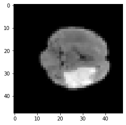
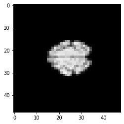
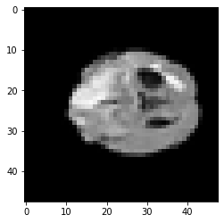
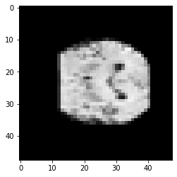
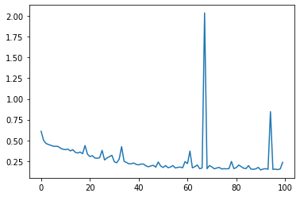
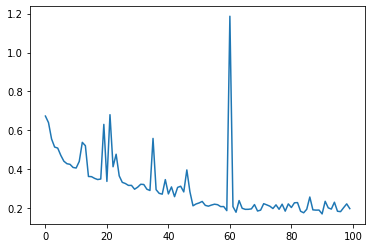

```python
#Stu no: 99210259
#stu name: Amir Pourmand
```


```python
device = 'cuda' if torch.cuda.is_available() else 'cpu'
print(f'Using {device} device')
```

    Using cuda device


```python
cuda = torch.device('cuda')
```


```python
 !wget https://github.com/mralisoltani/CNN_Tumor/raw/main/Tumor.zip

```

    --2021-12-04 19:48:40--  https://github.com/mralisoltani/CNN_Tumor/raw/main/Tumor.zip
    Resolving github.com (github.com)... 13.114.40.48
    Connecting to github.com (github.com)|13.114.40.48|:443... connected.
    HTTP request sent, awaiting response... 302 Found
    Location: https://raw.githubusercontent.com/mralisoltani/CNN_Tumor/main/Tumor.zip [following]
    --2021-12-04 19:48:40--  https://raw.githubusercontent.com/mralisoltani/CNN_Tumor/main/Tumor.zip
    Resolving raw.githubusercontent.com (raw.githubusercontent.com)... 185.199.108.133, 185.199.109.133, 185.199.111.133, ...
    Connecting to raw.githubusercontent.com (raw.githubusercontent.com)|185.199.108.133|:443... connected.
    HTTP request sent, awaiting response... 200 OK
    Length: 14338568 (14M) [application/zip]
    Saving to: ‘Tumor.zip’
    
    Tumor.zip           100%[===================>]  13.67M  --.-KB/s    in 0.1s    
    
    2021-12-04 19:48:42 (102 MB/s) - ‘Tumor.zip’ saved [14338568/14338568]
    


```python
!unzip /content/Tumor.zip

```


```python

```


```python
# -*- coding: utf-8 -*-
"""

@author: Ali Soltani
"""


import torch
from torchvision import transforms
import os
from PIL import Image
import numpy as np
import pandas as pds
from torch.utils.data import DataLoader,TensorDataset,random_split

############################################################## Loading Data
n = 3762
image=[]
cw = os.getcwd().replace(os.sep, '/')
trans = transforms.Compose([transforms.ToTensor()])
for i in range(n):
#    image.append(np.asarray(Image.open(cw + "/Brain_Tumor/Image" + str(i+1) + ".jpg")))
    image.append(np.array(Image.open(cw + "/Brain_Tumor/Image" + str(i+1) + ".jpg").resize((48,48))))

temp = pds.read_csv(cw + "/Brain_Tumor.csv",index_col=None, header=None).to_numpy()
temp = temp[1:,1]
targets = np.zeros((n,1),dtype=int)
targets = []
for i in range(n):
    targets.append(int(temp[i]))

data = np.array(image)
data = data/255
data = torch.from_numpy(data).permute((0,3,2,1))
data = data.float().to(cuda)
targets = torch.tensor(targets).to(cuda)
dataset = TensorDataset(data,targets)
batch_size = 4
val_size = int(np.ceil(len(dataset)*0.2))
train_size = len(dataset) - val_size 

train_data,test_data = random_split(dataset,[train_size,val_size])


train_loader = DataLoader(train_data,batch_size = batch_size,shuffle=True)
test_loader = DataLoader(test_data,batch_size = batch_size,shuffle=True)
```


```python
import matplotlib.pyplot as plt
from torchvision import transforms
```


```python
print("count of data:", len(train_data))
train_features, train_labels = next(iter(train_loader))
print(f"Feature batch shape: {train_features.size()}")
print(f"Labels batch shape: {train_labels.size()}")

for i in range(batch_size):
    img = train_features[i].squeeze()
    label = train_labels[i]
    im = transforms.ToPILImage()(img).convert("RGB")
    plt.imshow(im)
    plt.show()
    print(f"Label: {label}")
```

    count of data: 3009
    Feature batch shape: torch.Size([4, 3, 48, 48])
    Labels batch shape: torch.Size([4])


    

    


    Label: 1


    

    


    Label: 0


    

    


    Label: 1


    

    


    Label: 0


```python
import os
import torch
from torch import nn
from torch.utils.data import DataLoader
from torchvision import datasets, transforms

class NeuralNetwork(nn.Module):
    def __init__(self):
        super(NeuralNetwork, self).__init__()
        self.flatten = nn.Flatten()
        self.linear_relu_stack = nn.Sequential(
            nn.Linear(3*48*48, 512),
            nn.ReLU(),
            nn.Linear(512, 24),
            nn.ReLU(),
            nn.Linear(24, 2),
        )

    def forward(self, x):
        x = self.flatten(x)
        logits = self.linear_relu_stack(x)
        return logits
```


```python

```

    Using cuda device


```python
model = NeuralNetwork().to(device)
print(model)
```

    NeuralNetwork(
      (flatten): Flatten(start_dim=1, end_dim=-1)
      (linear_relu_stack): Sequential(
        (0): Linear(in_features=6912, out_features=512, bias=True)
        (1): ReLU()
        (2): Linear(in_features=512, out_features=24, bias=True)
        (3): ReLU()
        (4): Linear(in_features=24, out_features=2, bias=True)
      )
    )


```python
learning_rate = 1e-3
batch_size = 64
epochs = 100

loss_fn = nn.CrossEntropyLoss()

optimizer = torch.optim.SGD(model.parameters(), lr=learning_rate)

```


```python
def train_loop(dataloader, model, loss_fn, optimizer):
    size = len(dataloader.dataset)
    for batch, (X, y) in enumerate(dataloader):
        pred = model(X)
        loss = loss_fn(pred, y)

        optimizer.zero_grad()
        loss.backward()
        optimizer.step()

        if batch % 100 == 0:
            loss, current = loss.item(), batch * len(X)
            print(f"loss: {loss:>7f}  [{current:>5d}/{size:>5d}]")


def test_loop(dataloader, model, loss_fn):
    size = len(dataloader.dataset)
    num_batches = len(dataloader)
    test_loss, correct = 0, 0

    with torch.no_grad():
        for X, y in dataloader:
            pred = model(X)
            test_loss += loss_fn(pred, y).item()
            correct += (pred.argmax(1) == y).type(torch.float).sum().item()

    test_loss /= num_batches
    correct /= size
    print(f"Test Error: \n Accuracy: {(100*correct):>0.1f}%, Avg loss: {test_loss:>8f} \n")
    return test_loss
```


```python
loss_fn = nn.CrossEntropyLoss()
optimizer = torch.optim.SGD(model.parameters(), lr=learning_rate)

losses=[]
for t in range(epochs):
    print(f"Epoch {t+1}\n-------------------------------")
    train_loop(train_loader, model, loss_fn, optimizer)
    loss = test_loop(test_loader, model, loss_fn)
    losses.append(loss)
print("Done!")
```

    Epoch 1
    -------------------------------
    loss: 0.612874  [    0/ 3009]
    loss: 0.712673  [  400/ 3009]
    loss: 0.744615  [  800/ 3009]
    loss: 0.690195  [ 1200/ 3009]
    loss: 0.710857  [ 1600/ 3009]
    loss: 0.616541  [ 2000/ 3009]
    loss: 0.650407  [ 2400/ 3009]
    loss: 0.670259  [ 2800/ 3009]
    Test Error: 
     Accuracy: 78.8%, Avg loss: 0.609731 
    
    Epoch 2
    -------------------------------
    loss: 0.610377  [    0/ 3009]
    loss: 0.635636  [  400/ 3009]
    loss: 0.459467  [  800/ 3009]
    loss: 0.638018  [ 1200/ 3009]
    loss: 0.553621  [ 1600/ 3009]
    loss: 0.758643  [ 2000/ 3009]
    loss: 0.648250  [ 2400/ 3009]
    loss: 0.499889  [ 2800/ 3009]
    Test Error: 
     Accuracy: 79.0%, Avg loss: 0.501841 
    
    Epoch 3
    -------------------------------
    loss: 0.425109  [    0/ 3009]
    loss: 0.521330  [  400/ 3009]
    loss: 0.658485  [  800/ 3009]
    loss: 0.244719  [ 1200/ 3009]
    loss: 0.252357  [ 1600/ 3009]
    loss: 0.307023  [ 2000/ 3009]
    loss: 0.536315  [ 2400/ 3009]
    loss: 0.851961  [ 2800/ 3009]
    Test Error: 
     Accuracy: 80.1%, Avg loss: 0.463312 
    
    Epoch 4
    -------------------------------
    loss: 0.369217  [    0/ 3009]
    loss: 0.232987  [  400/ 3009]
    loss: 0.335672  [  800/ 3009]
    loss: 0.706650  [ 1200/ 3009]
    loss: 0.287788  [ 1600/ 3009]
    loss: 0.169689  [ 2000/ 3009]
    loss: 0.183748  [ 2400/ 3009]
    loss: 1.081773  [ 2800/ 3009]
    Test Error: 
     Accuracy: 80.5%, Avg loss: 0.449939 
    
    Epoch 5
    -------------------------------
    loss: 0.619481  [    0/ 3009]
    loss: 0.762072  [  400/ 3009]
    loss: 0.309186  [  800/ 3009]
    loss: 0.468054  [ 1200/ 3009]
    loss: 0.152687  [ 1600/ 3009]
    loss: 1.196430  [ 2000/ 3009]
    loss: 0.565655  [ 2400/ 3009]
    loss: 0.423156  [ 2800/ 3009]
    Test Error: 
     Accuracy: 81.1%, Avg loss: 0.440605 
    
    Epoch 6
    -------------------------------
    loss: 0.408311  [    0/ 3009]
    loss: 0.406658  [  400/ 3009]
    loss: 0.643183  [  800/ 3009]
    loss: 0.680348  [ 1200/ 3009]
    loss: 0.292098  [ 1600/ 3009]
    loss: 0.885864  [ 2000/ 3009]
    loss: 0.384026  [ 2400/ 3009]
    loss: 0.291240  [ 2800/ 3009]
    Test Error: 
     Accuracy: 81.5%, Avg loss: 0.429059 
    
    Epoch 7
    -------------------------------
    loss: 0.972317  [    0/ 3009]
    loss: 0.647492  [  400/ 3009]
    loss: 0.287916  [  800/ 3009]
    loss: 0.136399  [ 1200/ 3009]
    loss: 0.131110  [ 1600/ 3009]
    loss: 1.046456  [ 2000/ 3009]
    loss: 0.321376  [ 2400/ 3009]
    loss: 0.262513  [ 2800/ 3009]
    Test Error: 
     Accuracy: 81.4%, Avg loss: 0.428422 
    
    Epoch 8
    -------------------------------
    loss: 0.586174  [    0/ 3009]
    loss: 0.280675  [  400/ 3009]
    loss: 0.535293  [  800/ 3009]
    loss: 0.510741  [ 1200/ 3009]
    loss: 0.490539  [ 1600/ 3009]
    loss: 0.403635  [ 2000/ 3009]
    loss: 0.292357  [ 2400/ 3009]
    loss: 0.243813  [ 2800/ 3009]
    Test Error: 
     Accuracy: 81.1%, Avg loss: 0.425741 
    
    Epoch 9
    -------------------------------
    loss: 0.693683  [    0/ 3009]
    loss: 0.942616  [  400/ 3009]
    loss: 0.519126  [  800/ 3009]
    loss: 0.515375  [ 1200/ 3009]
    loss: 0.276121  [ 1600/ 3009]
    loss: 0.308702  [ 2000/ 3009]
    loss: 0.174399  [ 2400/ 3009]
    loss: 0.088865  [ 2800/ 3009]
    Test Error: 
     Accuracy: 82.6%, Avg loss: 0.404838 
    
    Epoch 10
    -------------------------------
    loss: 0.490923  [    0/ 3009]
    loss: 0.250209  [  400/ 3009]
    loss: 0.350554  [  800/ 3009]
    loss: 0.569447  [ 1200/ 3009]
    loss: 0.572317  [ 1600/ 3009]
    loss: 0.596234  [ 2000/ 3009]
    loss: 0.741490  [ 2400/ 3009]
    loss: 0.671194  [ 2800/ 3009]
    Test Error: 
     Accuracy: 83.4%, Avg loss: 0.393213 
    
    Epoch 11
    -------------------------------
    loss: 0.251380  [    0/ 3009]
    loss: 0.490289  [  400/ 3009]
    loss: 1.060655  [  800/ 3009]
    loss: 0.565315  [ 1200/ 3009]
    loss: 0.849334  [ 1600/ 3009]
    loss: 0.175850  [ 2000/ 3009]
    loss: 0.606803  [ 2400/ 3009]
    loss: 0.099015  [ 2800/ 3009]
    Test Error: 
     Accuracy: 83.3%, Avg loss: 0.387654 
    
    Epoch 12
    -------------------------------
    loss: 0.413961  [    0/ 3009]
    loss: 0.353818  [  400/ 3009]
    loss: 0.492692  [  800/ 3009]
    loss: 0.261699  [ 1200/ 3009]
    loss: 0.435635  [ 1600/ 3009]
    loss: 0.699563  [ 2000/ 3009]
    loss: 0.286699  [ 2400/ 3009]
    loss: 0.353499  [ 2800/ 3009]
    Test Error: 
     Accuracy: 82.3%, Avg loss: 0.394087 
    
    Epoch 13
    -------------------------------
    loss: 0.739688  [    0/ 3009]
    loss: 0.808778  [  400/ 3009]
    loss: 0.371513  [  800/ 3009]
    loss: 0.347069  [ 1200/ 3009]
    loss: 0.914741  [ 1600/ 3009]
    loss: 0.343169  [ 2000/ 3009]
    loss: 0.199363  [ 2400/ 3009]
    loss: 0.571568  [ 2800/ 3009]
    Test Error: 
     Accuracy: 83.9%, Avg loss: 0.373210 
    
    Epoch 14
    -------------------------------
    loss: 0.242214  [    0/ 3009]
    loss: 0.529473  [  400/ 3009]
    loss: 0.110571  [  800/ 3009]
    loss: 0.219881  [ 1200/ 3009]
    loss: 0.605801  [ 1600/ 3009]
    loss: 0.729178  [ 2000/ 3009]
    loss: 0.451821  [ 2400/ 3009]
    loss: 0.042259  [ 2800/ 3009]
    Test Error: 
     Accuracy: 82.7%, Avg loss: 0.387483 
    
    Epoch 15
    -------------------------------
    loss: 0.652645  [    0/ 3009]
    loss: 0.660620  [  400/ 3009]
    loss: 0.151364  [  800/ 3009]
    loss: 0.585606  [ 1200/ 3009]
    loss: 0.187032  [ 1600/ 3009]
    loss: 0.118159  [ 2000/ 3009]
    loss: 0.308171  [ 2400/ 3009]
    loss: 0.441323  [ 2800/ 3009]
    Test Error: 
     Accuracy: 85.4%, Avg loss: 0.356562 
    
    Epoch 16
    -------------------------------
    loss: 0.414405  [    0/ 3009]
    loss: 0.385131  [  400/ 3009]
    loss: 0.459647  [  800/ 3009]
    loss: 0.491250  [ 1200/ 3009]
    loss: 0.252520  [ 1600/ 3009]
    loss: 0.558517  [ 2000/ 3009]
    loss: 0.276253  [ 2400/ 3009]
    loss: 0.214704  [ 2800/ 3009]
    Test Error: 
     Accuracy: 85.1%, Avg loss: 0.347331 
    
    Epoch 17
    -------------------------------
    loss: 0.311998  [    0/ 3009]
    loss: 0.367243  [  400/ 3009]
    loss: 0.238140  [  800/ 3009]
    loss: 0.252870  [ 1200/ 3009]
    loss: 0.517217  [ 1600/ 3009]
    loss: 0.154063  [ 2000/ 3009]
    loss: 0.574752  [ 2400/ 3009]
    loss: 0.205588  [ 2800/ 3009]
    Test Error: 
     Accuracy: 84.7%, Avg loss: 0.359407 
    
    Epoch 18
    -------------------------------
    loss: 0.200745  [    0/ 3009]
    loss: 0.193018  [  400/ 3009]
    loss: 0.436503  [  800/ 3009]
    loss: 0.351975  [ 1200/ 3009]
    loss: 0.262803  [ 1600/ 3009]
    loss: 0.339808  [ 2000/ 3009]
    loss: 0.155746  [ 2400/ 3009]
    loss: 0.349147  [ 2800/ 3009]
    Test Error: 
     Accuracy: 85.5%, Avg loss: 0.338214 
    
    Epoch 19
    -------------------------------
    loss: 0.874758  [    0/ 3009]
    loss: 0.187211  [  400/ 3009]
    loss: 0.266102  [  800/ 3009]
    loss: 0.684857  [ 1200/ 3009]
    loss: 0.126850  [ 1600/ 3009]
    loss: 0.405240  [ 2000/ 3009]
    loss: 0.468569  [ 2400/ 3009]
    loss: 0.170313  [ 2800/ 3009]
    Test Error: 
     Accuracy: 78.6%, Avg loss: 0.438182 
    
    Epoch 20
    -------------------------------
    loss: 0.288537  [    0/ 3009]
    loss: 0.459627  [  400/ 3009]
    loss: 0.376274  [  800/ 3009]
    loss: 0.371028  [ 1200/ 3009]
    loss: 0.326232  [ 1600/ 3009]
    loss: 0.406395  [ 2000/ 3009]
    loss: 0.324307  [ 2400/ 3009]
    loss: 0.169120  [ 2800/ 3009]
    Test Error: 
     Accuracy: 86.3%, Avg loss: 0.333102 
    
    Epoch 21
    -------------------------------
    loss: 0.579771  [    0/ 3009]
    loss: 0.043862  [  400/ 3009]
    loss: 0.373217  [  800/ 3009]
    loss: 0.137673  [ 1200/ 3009]
    loss: 0.431986  [ 1600/ 3009]
    loss: 0.180526  [ 2000/ 3009]
    loss: 0.343980  [ 2400/ 3009]
    loss: 0.182292  [ 2800/ 3009]
    Test Error: 
     Accuracy: 87.0%, Avg loss: 0.304675 
    
    Epoch 22
    -------------------------------
    loss: 0.243134  [    0/ 3009]
    loss: 0.519196  [  400/ 3009]
    loss: 0.151192  [  800/ 3009]
    loss: 0.814512  [ 1200/ 3009]
    loss: 0.336175  [ 1600/ 3009]
    loss: 0.184668  [ 2000/ 3009]
    loss: 0.442557  [ 2400/ 3009]
    loss: 0.559415  [ 2800/ 3009]
    Test Error: 
     Accuracy: 86.9%, Avg loss: 0.315558 
    
    Epoch 23
    -------------------------------
    loss: 0.241646  [    0/ 3009]
    loss: 0.121983  [  400/ 3009]
    loss: 0.166792  [  800/ 3009]
    loss: 0.728975  [ 1200/ 3009]
    loss: 0.853758  [ 1600/ 3009]
    loss: 0.247208  [ 2000/ 3009]
    loss: 0.210000  [ 2400/ 3009]
    loss: 0.575594  [ 2800/ 3009]
    Test Error: 
     Accuracy: 87.5%, Avg loss: 0.287921 
    
    Epoch 24
    -------------------------------
    loss: 0.204562  [    0/ 3009]
    loss: 0.636178  [  400/ 3009]
    loss: 0.353221  [  800/ 3009]
    loss: 0.145395  [ 1200/ 3009]
    loss: 0.019980  [ 1600/ 3009]
    loss: 0.133911  [ 2000/ 3009]
    loss: 0.529071  [ 2400/ 3009]
    loss: 0.679501  [ 2800/ 3009]
    Test Error: 
     Accuracy: 87.4%, Avg loss: 0.283882 
    
    Epoch 25
    -------------------------------
    loss: 0.368221  [    0/ 3009]
    loss: 0.365529  [  400/ 3009]
    loss: 0.126380  [  800/ 3009]
    loss: 0.257044  [ 1200/ 3009]
    loss: 0.531492  [ 1600/ 3009]
    loss: 0.546171  [ 2000/ 3009]
    loss: 0.077782  [ 2400/ 3009]
    loss: 0.156337  [ 2800/ 3009]
    Test Error: 
     Accuracy: 88.6%, Avg loss: 0.291231 
    
    Epoch 26
    -------------------------------
    loss: 0.077332  [    0/ 3009]
    loss: 0.442437  [  400/ 3009]
    loss: 0.173262  [  800/ 3009]
    loss: 0.342794  [ 1200/ 3009]
    loss: 0.190451  [ 1600/ 3009]
    loss: 0.252560  [ 2000/ 3009]
    loss: 0.106319  [ 2400/ 3009]
    loss: 0.384746  [ 2800/ 3009]
    Test Error: 
     Accuracy: 82.6%, Avg loss: 0.379764 
    
    Epoch 27
    -------------------------------
    loss: 0.043573  [    0/ 3009]
    loss: 0.257958  [  400/ 3009]
    loss: 0.113562  [  800/ 3009]
    loss: 0.116501  [ 1200/ 3009]
    loss: 0.608645  [ 1600/ 3009]
    loss: 0.293663  [ 2000/ 3009]
    loss: 0.869821  [ 2400/ 3009]
    loss: 0.050862  [ 2800/ 3009]
    Test Error: 
     Accuracy: 88.6%, Avg loss: 0.263382 
    
    Epoch 28
    -------------------------------
    loss: 0.451397  [    0/ 3009]
    loss: 0.140293  [  400/ 3009]
    loss: 0.103293  [  800/ 3009]
    loss: 0.364420  [ 1200/ 3009]
    loss: 0.919895  [ 1600/ 3009]
    loss: 0.387272  [ 2000/ 3009]
    loss: 0.113433  [ 2400/ 3009]
    loss: 0.396482  [ 2800/ 3009]
    Test Error: 
     Accuracy: 87.8%, Avg loss: 0.287503 
    
    Epoch 29
    -------------------------------
    loss: 0.240750  [    0/ 3009]
    loss: 0.135038  [  400/ 3009]
    loss: 0.136483  [  800/ 3009]
    loss: 0.211313  [ 1200/ 3009]
    loss: 0.404109  [ 1600/ 3009]
    loss: 0.102361  [ 2000/ 3009]
    loss: 0.626404  [ 2400/ 3009]
    loss: 0.308952  [ 2800/ 3009]
    Test Error: 
     Accuracy: 86.9%, Avg loss: 0.303608 
    
    Epoch 30
    -------------------------------
    loss: 0.325404  [    0/ 3009]
    loss: 0.717290  [  400/ 3009]
    loss: 0.066294  [  800/ 3009]
    loss: 0.311741  [ 1200/ 3009]
    loss: 0.263317  [ 1600/ 3009]
    loss: 0.092243  [ 2000/ 3009]
    loss: 0.045577  [ 2400/ 3009]
    loss: 0.319441  [ 2800/ 3009]
    Test Error: 
     Accuracy: 84.9%, Avg loss: 0.320189 
    
    Epoch 31
    -------------------------------
    loss: 0.534368  [    0/ 3009]
    loss: 0.183639  [  400/ 3009]
    loss: 0.370600  [  800/ 3009]
    loss: 0.068155  [ 1200/ 3009]
    loss: 0.654767  [ 1600/ 3009]
    loss: 0.113649  [ 2000/ 3009]
    loss: 0.090134  [ 2400/ 3009]
    loss: 0.344198  [ 2800/ 3009]
    Test Error: 
     Accuracy: 90.6%, Avg loss: 0.242058 
    
    Epoch 32
    -------------------------------
    loss: 0.574545  [    0/ 3009]
    loss: 0.063914  [  400/ 3009]
    loss: 0.198321  [  800/ 3009]
    loss: 0.197522  [ 1200/ 3009]
    loss: 0.062481  [ 1600/ 3009]
    loss: 0.398479  [ 2000/ 3009]
    loss: 0.067294  [ 2400/ 3009]
    loss: 0.121848  [ 2800/ 3009]
    Test Error: 
     Accuracy: 90.3%, Avg loss: 0.229504 
    
    Epoch 33
    -------------------------------
    loss: 0.155469  [    0/ 3009]
    loss: 0.525266  [  400/ 3009]
    loss: 0.061572  [  800/ 3009]
    loss: 0.099578  [ 1200/ 3009]
    loss: 0.167400  [ 1600/ 3009]
    loss: 0.133902  [ 2000/ 3009]
    loss: 0.022538  [ 2400/ 3009]
    loss: 0.120725  [ 2800/ 3009]
    Test Error: 
     Accuracy: 88.4%, Avg loss: 0.273928 
    
    Epoch 34
    -------------------------------
    loss: 0.380336  [    0/ 3009]
    loss: 0.092845  [  400/ 3009]
    loss: 0.227845  [  800/ 3009]
    loss: 0.403331  [ 1200/ 3009]
    loss: 0.419965  [ 1600/ 3009]
    loss: 0.309798  [ 2000/ 3009]
    loss: 0.153747  [ 2400/ 3009]
    loss: 0.248192  [ 2800/ 3009]
    Test Error: 
     Accuracy: 81.3%, Avg loss: 0.424367 
    
    Epoch 35
    -------------------------------
    loss: 0.019522  [    0/ 3009]
    loss: 0.033974  [  400/ 3009]
    loss: 0.030182  [  800/ 3009]
    loss: 0.490474  [ 1200/ 3009]
    loss: 0.404290  [ 1600/ 3009]
    loss: 0.031227  [ 2000/ 3009]
    loss: 0.060337  [ 2400/ 3009]
    loss: 0.035989  [ 2800/ 3009]
    Test Error: 
     Accuracy: 89.0%, Avg loss: 0.247775 
    
    Epoch 36
    -------------------------------
    loss: 0.136393  [    0/ 3009]
    loss: 0.434957  [  400/ 3009]
    loss: 0.068037  [  800/ 3009]
    loss: 0.250394  [ 1200/ 3009]
    loss: 0.379639  [ 1600/ 3009]
    loss: 0.154445  [ 2000/ 3009]
    loss: 0.421805  [ 2400/ 3009]
    loss: 0.107628  [ 2800/ 3009]
    Test Error: 
     Accuracy: 90.6%, Avg loss: 0.232820 
    
    Epoch 37
    -------------------------------
    loss: 0.214086  [    0/ 3009]
    loss: 0.256247  [  400/ 3009]
    loss: 0.495287  [  800/ 3009]
    loss: 0.031020  [ 1200/ 3009]
    loss: 0.155265  [ 1600/ 3009]
    loss: 0.371716  [ 2000/ 3009]
    loss: 0.227169  [ 2400/ 3009]
    loss: 0.337771  [ 2800/ 3009]
    Test Error: 
     Accuracy: 90.8%, Avg loss: 0.216823 
    
    Epoch 38
    -------------------------------
    loss: 0.096700  [    0/ 3009]
    loss: 0.144805  [  400/ 3009]
    loss: 0.208566  [  800/ 3009]
    loss: 0.069215  [ 1200/ 3009]
    loss: 0.052309  [ 1600/ 3009]
    loss: 0.520875  [ 2000/ 3009]
    loss: 0.346237  [ 2400/ 3009]
    loss: 0.175983  [ 2800/ 3009]
    Test Error: 
     Accuracy: 91.2%, Avg loss: 0.218782 
    
    Epoch 39
    -------------------------------
    loss: 0.305555  [    0/ 3009]
    loss: 0.150947  [  400/ 3009]
    loss: 0.500910  [  800/ 3009]
    loss: 0.219239  [ 1200/ 3009]
    loss: 0.102949  [ 1600/ 3009]
    loss: 0.114788  [ 2000/ 3009]
    loss: 0.164632  [ 2400/ 3009]
    loss: 0.062595  [ 2800/ 3009]
    Test Error: 
     Accuracy: 91.2%, Avg loss: 0.226254 
    
    Epoch 40
    -------------------------------
    loss: 0.006157  [    0/ 3009]
    loss: 0.191176  [  400/ 3009]
    loss: 0.359908  [  800/ 3009]
    loss: 0.117878  [ 1200/ 3009]
    loss: 0.083638  [ 1600/ 3009]
    loss: 0.127077  [ 2000/ 3009]
    loss: 0.101555  [ 2400/ 3009]
    loss: 0.026675  [ 2800/ 3009]
    Test Error: 
     Accuracy: 91.4%, Avg loss: 0.209517 
    
    Epoch 41
    -------------------------------
    loss: 0.461294  [    0/ 3009]
    loss: 0.113928  [  400/ 3009]
    loss: 0.074724  [  800/ 3009]
    loss: 0.534803  [ 1200/ 3009]
    loss: 0.017591  [ 1600/ 3009]
    loss: 0.078571  [ 2000/ 3009]
    loss: 0.137161  [ 2400/ 3009]
    loss: 0.194793  [ 2800/ 3009]
    Test Error: 
     Accuracy: 91.5%, Avg loss: 0.204340 
    
    Epoch 42
    -------------------------------
    loss: 0.009259  [    0/ 3009]
    loss: 0.102977  [  400/ 3009]
    loss: 0.011841  [  800/ 3009]
    loss: 0.122268  [ 1200/ 3009]
    loss: 0.522349  [ 1600/ 3009]
    loss: 0.016986  [ 2000/ 3009]
    loss: 0.127133  [ 2400/ 3009]
    loss: 0.621686  [ 2800/ 3009]
    Test Error: 
     Accuracy: 91.8%, Avg loss: 0.214583 
    
    Epoch 43
    -------------------------------
    loss: 0.019270  [    0/ 3009]
    loss: 0.194109  [  400/ 3009]
    loss: 0.098511  [  800/ 3009]
    loss: 0.510885  [ 1200/ 3009]
    loss: 0.074684  [ 1600/ 3009]
    loss: 0.028622  [ 2000/ 3009]
    loss: 0.003813  [ 2400/ 3009]
    loss: 0.217556  [ 2800/ 3009]
    Test Error: 
     Accuracy: 91.1%, Avg loss: 0.213688 
    
    Epoch 44
    -------------------------------
    loss: 0.249906  [    0/ 3009]
    loss: 0.036435  [  400/ 3009]
    loss: 0.382848  [  800/ 3009]
    loss: 0.138155  [ 1200/ 3009]
    loss: 0.015072  [ 1600/ 3009]
    loss: 0.183296  [ 2000/ 3009]
    loss: 0.765493  [ 2400/ 3009]
    loss: 0.002745  [ 2800/ 3009]
    Test Error: 
     Accuracy: 91.6%, Avg loss: 0.192210 
    
    Epoch 45
    -------------------------------
    loss: 0.048382  [    0/ 3009]
    loss: 0.007643  [  400/ 3009]
    loss: 0.002455  [  800/ 3009]
    loss: 0.314233  [ 1200/ 3009]
    loss: 0.250882  [ 1600/ 3009]
    loss: 0.187964  [ 2000/ 3009]
    loss: 0.310398  [ 2400/ 3009]
    loss: 0.292651  [ 2800/ 3009]
    Test Error: 
     Accuracy: 92.3%, Avg loss: 0.181595 
    
    Epoch 46
    -------------------------------
    loss: 0.526552  [    0/ 3009]
    loss: 0.350501  [  400/ 3009]
    loss: 0.018045  [  800/ 3009]
    loss: 0.241172  [ 1200/ 3009]
    loss: 0.024312  [ 1600/ 3009]
    loss: 0.064598  [ 2000/ 3009]
    loss: 0.066437  [ 2400/ 3009]
    loss: 0.121476  [ 2800/ 3009]
    Test Error: 
     Accuracy: 92.2%, Avg loss: 0.192466 
    
    Epoch 47
    -------------------------------
    loss: 0.237301  [    0/ 3009]
    loss: 0.018461  [  400/ 3009]
    loss: 0.023916  [  800/ 3009]
    loss: 0.106190  [ 1200/ 3009]
    loss: 0.033839  [ 1600/ 3009]
    loss: 0.025127  [ 2000/ 3009]
    loss: 0.095227  [ 2400/ 3009]
    loss: 0.449622  [ 2800/ 3009]
    Test Error: 
     Accuracy: 92.0%, Avg loss: 0.198553 
    
    Epoch 48
    -------------------------------
    loss: 0.004209  [    0/ 3009]
    loss: 0.232386  [  400/ 3009]
    loss: 0.401816  [  800/ 3009]
    loss: 0.320880  [ 1200/ 3009]
    loss: 0.032645  [ 1600/ 3009]
    loss: 0.070538  [ 2000/ 3009]
    loss: 0.078433  [ 2400/ 3009]
    loss: 0.031259  [ 2800/ 3009]
    Test Error: 
     Accuracy: 93.1%, Avg loss: 0.176062 
    
    Epoch 49
    -------------------------------
    loss: 0.280083  [    0/ 3009]
    loss: 0.034082  [  400/ 3009]
    loss: 0.059922  [  800/ 3009]
    loss: 0.024797  [ 1200/ 3009]
    loss: 0.078281  [ 1600/ 3009]
    loss: 0.443106  [ 2000/ 3009]
    loss: 0.164287  [ 2400/ 3009]
    loss: 0.131497  [ 2800/ 3009]
    Test Error: 
     Accuracy: 90.8%, Avg loss: 0.238801 
    
    Epoch 50
    -------------------------------
    loss: 0.008298  [    0/ 3009]
    loss: 0.043125  [  400/ 3009]
    loss: 0.075283  [  800/ 3009]
    loss: 0.077505  [ 1200/ 3009]
    loss: 0.283944  [ 1600/ 3009]
    loss: 0.121972  [ 2000/ 3009]
    loss: 0.008125  [ 2400/ 3009]
    loss: 0.080740  [ 2800/ 3009]
    Test Error: 
     Accuracy: 91.5%, Avg loss: 0.191261 
    
    Epoch 51
    -------------------------------
    loss: 0.044427  [    0/ 3009]
    loss: 0.186360  [  400/ 3009]
    loss: 0.002991  [  800/ 3009]
    loss: 0.129555  [ 1200/ 3009]
    loss: 0.063185  [ 1600/ 3009]
    loss: 0.137349  [ 2000/ 3009]
    loss: 0.455101  [ 2400/ 3009]
    loss: 0.053374  [ 2800/ 3009]
    Test Error: 
     Accuracy: 92.2%, Avg loss: 0.172863 
    
    Epoch 52
    -------------------------------
    loss: 0.143869  [    0/ 3009]
    loss: 0.026640  [  400/ 3009]
    loss: 0.060242  [  800/ 3009]
    loss: 0.087954  [ 1200/ 3009]
    loss: 0.110793  [ 1600/ 3009]
    loss: 0.133597  [ 2000/ 3009]
    loss: 0.013762  [ 2400/ 3009]
    loss: 0.129186  [ 2800/ 3009]
    Test Error: 
     Accuracy: 92.6%, Avg loss: 0.195690 
    
    Epoch 53
    -------------------------------
    loss: 0.627114  [    0/ 3009]
    loss: 0.474869  [  400/ 3009]
    loss: 0.213273  [  800/ 3009]
    loss: 0.040031  [ 1200/ 3009]
    loss: 0.007852  [ 1600/ 3009]
    loss: 0.031571  [ 2000/ 3009]
    loss: 0.001123  [ 2400/ 3009]
    loss: 0.028975  [ 2800/ 3009]
    Test Error: 
     Accuracy: 92.0%, Avg loss: 0.170234 
    
    Epoch 54
    -------------------------------
    loss: 0.074014  [    0/ 3009]
    loss: 0.036522  [  400/ 3009]
    loss: 0.025333  [  800/ 3009]
    loss: 0.024615  [ 1200/ 3009]
    loss: 0.063585  [ 1600/ 3009]
    loss: 0.166636  [ 2000/ 3009]
    loss: 0.134701  [ 2400/ 3009]
    loss: 0.147738  [ 2800/ 3009]
    Test Error: 
     Accuracy: 92.8%, Avg loss: 0.177144 
    
    Epoch 55
    -------------------------------
    loss: 0.035748  [    0/ 3009]
    loss: 0.011622  [  400/ 3009]
    loss: 0.015642  [  800/ 3009]
    loss: 0.351276  [ 1200/ 3009]
    loss: 0.360488  [ 1600/ 3009]
    loss: 0.028831  [ 2000/ 3009]
    loss: 0.750125  [ 2400/ 3009]
    loss: 0.006516  [ 2800/ 3009]
    Test Error: 
     Accuracy: 92.3%, Avg loss: 0.195945 
    
    Epoch 56
    -------------------------------
    loss: 0.032789  [    0/ 3009]
    loss: 0.077465  [  400/ 3009]
    loss: 0.373449  [  800/ 3009]
    loss: 0.178403  [ 1200/ 3009]
    loss: 0.041034  [ 1600/ 3009]
    loss: 0.272264  [ 2000/ 3009]
    loss: 0.090671  [ 2400/ 3009]
    loss: 0.478518  [ 2800/ 3009]
    Test Error: 
     Accuracy: 92.4%, Avg loss: 0.166679 
    
    Epoch 57
    -------------------------------
    loss: 0.374019  [    0/ 3009]
    loss: 0.063673  [  400/ 3009]
    loss: 0.116436  [  800/ 3009]
    loss: 0.044060  [ 1200/ 3009]
    loss: 0.020648  [ 1600/ 3009]
    loss: 0.317455  [ 2000/ 3009]
    loss: 0.016334  [ 2400/ 3009]
    loss: 0.136470  [ 2800/ 3009]
    Test Error: 
     Accuracy: 92.4%, Avg loss: 0.173969 
    
    Epoch 58
    -------------------------------
    loss: 0.101519  [    0/ 3009]
    loss: 0.071241  [  400/ 3009]
    loss: 0.150820  [  800/ 3009]
    loss: 0.042686  [ 1200/ 3009]
    loss: 0.021328  [ 1600/ 3009]
    loss: 0.080425  [ 2000/ 3009]
    loss: 0.288905  [ 2400/ 3009]
    loss: 0.006239  [ 2800/ 3009]
    Test Error: 
     Accuracy: 93.1%, Avg loss: 0.177651 
    
    Epoch 59
    -------------------------------
    loss: 0.037491  [    0/ 3009]
    loss: 0.003153  [  400/ 3009]
    loss: 0.253904  [  800/ 3009]
    loss: 0.137205  [ 1200/ 3009]
    loss: 0.329658  [ 1600/ 3009]
    loss: 0.357776  [ 2000/ 3009]
    loss: 0.881824  [ 2400/ 3009]
    loss: 0.095342  [ 2800/ 3009]
    Test Error: 
     Accuracy: 92.7%, Avg loss: 0.169382 
    
    Epoch 60
    -------------------------------
    loss: 0.645445  [    0/ 3009]
    loss: 0.011491  [  400/ 3009]
    loss: 0.107692  [  800/ 3009]
    loss: 0.069701  [ 1200/ 3009]
    loss: 0.037588  [ 1600/ 3009]
    loss: 0.721339  [ 2000/ 3009]
    loss: 0.373313  [ 2400/ 3009]
    loss: 0.023436  [ 2800/ 3009]
    Test Error: 
     Accuracy: 91.1%, Avg loss: 0.243987 
    
    Epoch 61
    -------------------------------
    loss: 0.006850  [    0/ 3009]
    loss: 0.004590  [  400/ 3009]
    loss: 0.099188  [  800/ 3009]
    loss: 0.014713  [ 1200/ 3009]
    loss: 0.049664  [ 1600/ 3009]
    loss: 0.039915  [ 2000/ 3009]
    loss: 0.083186  [ 2400/ 3009]
    loss: 0.061643  [ 2800/ 3009]
    Test Error: 
     Accuracy: 91.1%, Avg loss: 0.219652 
    
    Epoch 62
    -------------------------------
    loss: 0.143806  [    0/ 3009]
    loss: 0.165197  [  400/ 3009]
    loss: 0.039134  [  800/ 3009]
    loss: 0.225474  [ 1200/ 3009]
    loss: 0.257318  [ 1600/ 3009]
    loss: 0.216942  [ 2000/ 3009]
    loss: 0.169730  [ 2400/ 3009]
    loss: 0.000418  [ 2800/ 3009]
    Test Error: 
     Accuracy: 84.1%, Avg loss: 0.371053 
    
    Epoch 63
    -------------------------------
    loss: 0.513983  [    0/ 3009]
    loss: 0.528835  [  400/ 3009]
    loss: 0.008454  [  800/ 3009]
    loss: 0.156376  [ 1200/ 3009]
    loss: 0.099866  [ 1600/ 3009]
    loss: 0.076091  [ 2000/ 3009]
    loss: 0.034282  [ 2400/ 3009]
    loss: 0.004475  [ 2800/ 3009]
    Test Error: 
     Accuracy: 92.7%, Avg loss: 0.168315 
    
    Epoch 64
    -------------------------------
    loss: 0.254291  [    0/ 3009]
    loss: 0.268837  [  400/ 3009]
    loss: 0.113617  [  800/ 3009]
    loss: 0.462906  [ 1200/ 3009]
    loss: 0.035124  [ 1600/ 3009]
    loss: 0.201200  [ 2000/ 3009]
    loss: 0.038360  [ 2400/ 3009]
    loss: 0.038572  [ 2800/ 3009]
    Test Error: 
     Accuracy: 92.6%, Avg loss: 0.182171 
    
    Epoch 65
    -------------------------------
    loss: 0.022693  [    0/ 3009]
    loss: 0.052663  [  400/ 3009]
    loss: 0.102111  [  800/ 3009]
    loss: 0.020169  [ 1200/ 3009]
    loss: 0.640791  [ 1600/ 3009]
    loss: 0.272567  [ 2000/ 3009]
    loss: 0.009876  [ 2400/ 3009]
    loss: 0.074759  [ 2800/ 3009]
    Test Error: 
     Accuracy: 92.7%, Avg loss: 0.203175 
    
    Epoch 66
    -------------------------------
    loss: 0.037524  [    0/ 3009]
    loss: 0.140557  [  400/ 3009]
    loss: 0.022173  [  800/ 3009]
    loss: 0.160867  [ 1200/ 3009]
    loss: 0.146776  [ 1600/ 3009]
    loss: 0.038691  [ 2000/ 3009]
    loss: 0.096679  [ 2400/ 3009]
    loss: 1.046202  [ 2800/ 3009]
    Test Error: 
     Accuracy: 93.4%, Avg loss: 0.157990 
    
    Epoch 67
    -------------------------------
    loss: 0.000903  [    0/ 3009]
    loss: 0.461546  [  400/ 3009]
    loss: 0.373352  [  800/ 3009]
    loss: 0.004955  [ 1200/ 3009]
    loss: 0.205911  [ 1600/ 3009]
    loss: 0.028938  [ 2000/ 3009]
    loss: 0.041878  [ 2400/ 3009]
    loss: 0.018624  [ 2800/ 3009]
    Test Error: 
     Accuracy: 92.8%, Avg loss: 0.167001 
    
    Epoch 68
    -------------------------------
    loss: 0.115579  [    0/ 3009]
    loss: 0.213361  [  400/ 3009]
    loss: 0.009721  [  800/ 3009]
    loss: 0.092563  [ 1200/ 3009]
    loss: 0.050504  [ 1600/ 3009]
    loss: 0.002960  [ 2000/ 3009]
    loss: 0.270609  [ 2400/ 3009]
    loss: 0.013008  [ 2800/ 3009]
    Test Error: 
     Accuracy: 61.1%, Avg loss: 2.038542 
    
    Epoch 69
    -------------------------------
    loss: 1.104445  [    0/ 3009]
    loss: 0.010758  [  400/ 3009]
    loss: 0.207830  [  800/ 3009]
    loss: 0.376282  [ 1200/ 3009]
    loss: 0.010249  [ 1600/ 3009]
    loss: 0.011536  [ 2000/ 3009]
    loss: 0.025457  [ 2400/ 3009]
    loss: 0.000742  [ 2800/ 3009]
    Test Error: 
     Accuracy: 93.8%, Avg loss: 0.157803 
    
    Epoch 70
    -------------------------------
    loss: 0.004517  [    0/ 3009]
    loss: 0.021887  [  400/ 3009]
    loss: 0.392092  [  800/ 3009]
    loss: 0.021333  [ 1200/ 3009]
    loss: 0.029881  [ 1600/ 3009]
    loss: 0.014090  [ 2000/ 3009]
    loss: 0.576094  [ 2400/ 3009]
    loss: 0.016256  [ 2800/ 3009]
    Test Error: 
     Accuracy: 92.2%, Avg loss: 0.196472 
    
    Epoch 71
    -------------------------------
    loss: 0.015786  [    0/ 3009]
    loss: 0.024099  [  400/ 3009]
    loss: 0.010376  [  800/ 3009]
    loss: 0.270794  [ 1200/ 3009]
    loss: 0.006614  [ 1600/ 3009]
    loss: 0.075882  [ 2000/ 3009]
    loss: 0.201820  [ 2400/ 3009]
    loss: 0.106887  [ 2800/ 3009]
    Test Error: 
     Accuracy: 93.1%, Avg loss: 0.179289 
    
    Epoch 72
    -------------------------------
    loss: 0.066107  [    0/ 3009]
    loss: 0.044215  [  400/ 3009]
    loss: 0.039005  [  800/ 3009]
    loss: 0.040244  [ 1200/ 3009]
    loss: 0.112673  [ 1600/ 3009]
    loss: 0.066581  [ 2000/ 3009]
    loss: 0.014780  [ 2400/ 3009]
    loss: 0.001996  [ 2800/ 3009]
    Test Error: 
     Accuracy: 93.2%, Avg loss: 0.156728 
    
    Epoch 73
    -------------------------------
    loss: 0.054308  [    0/ 3009]
    loss: 0.135788  [  400/ 3009]
    loss: 0.488879  [  800/ 3009]
    loss: 0.058845  [ 1200/ 3009]
    loss: 0.001655  [ 1600/ 3009]
    loss: 0.170348  [ 2000/ 3009]
    loss: 0.597990  [ 2400/ 3009]
    loss: 0.012858  [ 2800/ 3009]
    Test Error: 
     Accuracy: 93.2%, Avg loss: 0.167063 
    
    Epoch 74
    -------------------------------
    loss: 0.006741  [    0/ 3009]
    loss: 0.009878  [  400/ 3009]
    loss: 0.023172  [  800/ 3009]
    loss: 0.049223  [ 1200/ 3009]
    loss: 0.035407  [ 1600/ 3009]
    loss: 0.281755  [ 2000/ 3009]
    loss: 0.039603  [ 2400/ 3009]
    loss: 0.014024  [ 2800/ 3009]
    Test Error: 
     Accuracy: 93.2%, Avg loss: 0.173177 
    
    Epoch 75
    -------------------------------
    loss: 0.069044  [    0/ 3009]
    loss: 0.013170  [  400/ 3009]
    loss: 0.075636  [  800/ 3009]
    loss: 0.023451  [ 1200/ 3009]
    loss: 0.006656  [ 1600/ 3009]
    loss: 0.006781  [ 2000/ 3009]
    loss: 0.040001  [ 2400/ 3009]
    loss: 0.026015  [ 2800/ 3009]
    Test Error: 
     Accuracy: 93.5%, Avg loss: 0.154842 
    
    Epoch 76
    -------------------------------
    loss: 0.129830  [    0/ 3009]
    loss: 0.040514  [  400/ 3009]
    loss: 0.097983  [  800/ 3009]
    loss: 0.010570  [ 1200/ 3009]
    loss: 0.363309  [ 1600/ 3009]
    loss: 0.000646  [ 2000/ 3009]
    loss: 1.124698  [ 2400/ 3009]
    loss: 0.000920  [ 2800/ 3009]
    Test Error: 
     Accuracy: 93.6%, Avg loss: 0.158166 
    
    Epoch 77
    -------------------------------
    loss: 0.048524  [    0/ 3009]
    loss: 0.013145  [  400/ 3009]
    loss: 0.020278  [  800/ 3009]
    loss: 0.033555  [ 1200/ 3009]
    loss: 0.019650  [ 1600/ 3009]
    loss: 0.019511  [ 2000/ 3009]
    loss: 0.086447  [ 2400/ 3009]
    loss: 0.087477  [ 2800/ 3009]
    Test Error: 
     Accuracy: 93.8%, Avg loss: 0.156554 
    
    Epoch 78
    -------------------------------
    loss: 0.033737  [    0/ 3009]
    loss: 0.000792  [  400/ 3009]
    loss: 0.252864  [  800/ 3009]
    loss: 0.099363  [ 1200/ 3009]
    loss: 0.077244  [ 1600/ 3009]
    loss: 0.008394  [ 2000/ 3009]
    loss: 0.384961  [ 2400/ 3009]
    loss: 0.036216  [ 2800/ 3009]
    Test Error: 
     Accuracy: 93.9%, Avg loss: 0.159181 
    
    Epoch 79
    -------------------------------
    loss: 0.000724  [    0/ 3009]
    loss: 0.014339  [  400/ 3009]
    loss: 0.066182  [  800/ 3009]
    loss: 0.110747  [ 1200/ 3009]
    loss: 0.059909  [ 1600/ 3009]
    loss: 0.487052  [ 2000/ 3009]
    loss: 0.352145  [ 2400/ 3009]
    loss: 0.001679  [ 2800/ 3009]
    Test Error: 
     Accuracy: 90.6%, Avg loss: 0.245481 
    
    Epoch 80
    -------------------------------
    loss: 0.031259  [    0/ 3009]
    loss: 0.092865  [  400/ 3009]
    loss: 0.002832  [  800/ 3009]
    loss: 0.165064  [ 1200/ 3009]
    loss: 0.002293  [ 1600/ 3009]
    loss: 0.059774  [ 2000/ 3009]
    loss: 0.000781  [ 2400/ 3009]
    loss: 0.154801  [ 2800/ 3009]
    Test Error: 
     Accuracy: 94.4%, Avg loss: 0.159270 
    
    Epoch 81
    -------------------------------
    loss: 0.024156  [    0/ 3009]
    loss: 0.031090  [  400/ 3009]
    loss: 0.006847  [  800/ 3009]
    loss: 0.030935  [ 1200/ 3009]
    loss: 0.217824  [ 1600/ 3009]
    loss: 0.020595  [ 2000/ 3009]
    loss: 0.025340  [ 2400/ 3009]
    loss: 0.311222  [ 2800/ 3009]
    Test Error: 
     Accuracy: 93.1%, Avg loss: 0.171679 
    
    Epoch 82
    -------------------------------
    loss: 0.001649  [    0/ 3009]
    loss: 0.043509  [  400/ 3009]
    loss: 0.570816  [  800/ 3009]
    loss: 0.002152  [ 1200/ 3009]
    loss: 0.066446  [ 1600/ 3009]
    loss: 0.005270  [ 2000/ 3009]
    loss: 0.026196  [ 2400/ 3009]
    loss: 0.007359  [ 2800/ 3009]
    Test Error: 
     Accuracy: 92.6%, Avg loss: 0.202278 
    
    Epoch 83
    -------------------------------
    loss: 0.000882  [    0/ 3009]
    loss: 0.051283  [  400/ 3009]
    loss: 0.266509  [  800/ 3009]
    loss: 0.018254  [ 1200/ 3009]
    loss: 0.101562  [ 1600/ 3009]
    loss: 0.041997  [ 2000/ 3009]
    loss: 0.023880  [ 2400/ 3009]
    loss: 0.227639  [ 2800/ 3009]
    Test Error: 
     Accuracy: 92.8%, Avg loss: 0.183190 
    
    Epoch 84
    -------------------------------
    loss: 0.007798  [    0/ 3009]
    loss: 0.000857  [  400/ 3009]
    loss: 0.034641  [  800/ 3009]
    loss: 0.003413  [ 1200/ 3009]
    loss: 0.009463  [ 1600/ 3009]
    loss: 0.047884  [ 2000/ 3009]
    loss: 0.091985  [ 2400/ 3009]
    loss: 0.044464  [ 2800/ 3009]
    Test Error: 
     Accuracy: 93.9%, Avg loss: 0.163869 
    
    Epoch 85
    -------------------------------
    loss: 0.020284  [    0/ 3009]
    loss: 0.063107  [  400/ 3009]
    loss: 0.000190  [  800/ 3009]
    loss: 0.005738  [ 1200/ 3009]
    loss: 0.080214  [ 1600/ 3009]
    loss: 0.008644  [ 2000/ 3009]
    loss: 0.005532  [ 2400/ 3009]
    loss: 0.018630  [ 2800/ 3009]
    Test Error: 
     Accuracy: 93.6%, Avg loss: 0.159843 
    
    Epoch 86
    -------------------------------
    loss: 0.002318  [    0/ 3009]
    loss: 0.005261  [  400/ 3009]
    loss: 0.208498  [  800/ 3009]
    loss: 0.096166  [ 1200/ 3009]
    loss: 0.006423  [ 1600/ 3009]
    loss: 0.373555  [ 2000/ 3009]
    loss: 0.020800  [ 2400/ 3009]
    loss: 0.013847  [ 2800/ 3009]
    Test Error: 
     Accuracy: 93.5%, Avg loss: 0.195176 
    
    Epoch 87
    -------------------------------
    loss: 0.001203  [    0/ 3009]
    loss: 0.047656  [  400/ 3009]
    loss: 0.175541  [  800/ 3009]
    loss: 0.023774  [ 1200/ 3009]
    loss: 0.679213  [ 1600/ 3009]
    loss: 0.689421  [ 2000/ 3009]
    loss: 0.056002  [ 2400/ 3009]
    loss: 0.019270  [ 2800/ 3009]
    Test Error: 
     Accuracy: 93.8%, Avg loss: 0.153779 
    
    Epoch 88
    -------------------------------
    loss: 0.011208  [    0/ 3009]
    loss: 0.009703  [  400/ 3009]
    loss: 0.010386  [  800/ 3009]
    loss: 0.022391  [ 1200/ 3009]
    loss: 0.008434  [ 1600/ 3009]
    loss: 0.191793  [ 2000/ 3009]
    loss: 0.623906  [ 2400/ 3009]
    loss: 0.013278  [ 2800/ 3009]
    Test Error: 
     Accuracy: 94.3%, Avg loss: 0.150847 
    
    Epoch 89
    -------------------------------
    loss: 0.018373  [    0/ 3009]
    loss: 0.054582  [  400/ 3009]
    loss: 0.005354  [  800/ 3009]
    loss: 0.232555  [ 1200/ 3009]
    loss: 0.071037  [ 1600/ 3009]
    loss: 0.011367  [ 2000/ 3009]
    loss: 0.036455  [ 2400/ 3009]
    loss: 0.044183  [ 2800/ 3009]
    Test Error: 
     Accuracy: 93.9%, Avg loss: 0.156266 
    
    Epoch 90
    -------------------------------
    loss: 0.004823  [    0/ 3009]
    loss: 0.083422  [  400/ 3009]
    loss: 0.423318  [  800/ 3009]
    loss: 0.013316  [ 1200/ 3009]
    loss: 0.132344  [ 1600/ 3009]
    loss: 0.111381  [ 2000/ 3009]
    loss: 0.000617  [ 2400/ 3009]
    loss: 0.016089  [ 2800/ 3009]
    Test Error: 
     Accuracy: 93.6%, Avg loss: 0.173889 
    
    Epoch 91
    -------------------------------
    loss: 0.005728  [    0/ 3009]
    loss: 0.266697  [  400/ 3009]
    loss: 0.001900  [  800/ 3009]
    loss: 0.119340  [ 1200/ 3009]
    loss: 0.035948  [ 1600/ 3009]
    loss: 0.080968  [ 2000/ 3009]
    loss: 0.078530  [ 2400/ 3009]
    loss: 0.166100  [ 2800/ 3009]
    Test Error: 
     Accuracy: 94.3%, Avg loss: 0.143272 
    
    Epoch 92
    -------------------------------
    loss: 0.001165  [    0/ 3009]
    loss: 0.024623  [  400/ 3009]
    loss: 0.000607  [  800/ 3009]
    loss: 0.000455  [ 1200/ 3009]
    loss: 0.005446  [ 1600/ 3009]
    loss: 0.007006  [ 2000/ 3009]
    loss: 0.007421  [ 2400/ 3009]
    loss: 0.002075  [ 2800/ 3009]
    Test Error: 
     Accuracy: 94.3%, Avg loss: 0.154272 
    
    Epoch 93
    -------------------------------
    loss: 0.018297  [    0/ 3009]
    loss: 0.003098  [  400/ 3009]
    loss: 0.392535  [  800/ 3009]
    loss: 0.152666  [ 1200/ 3009]
    loss: 0.308703  [ 1600/ 3009]
    loss: 0.343534  [ 2000/ 3009]
    loss: 0.028807  [ 2400/ 3009]
    loss: 0.055016  [ 2800/ 3009]
    Test Error: 
     Accuracy: 94.4%, Avg loss: 0.158419 
    
    Epoch 94
    -------------------------------
    loss: 0.077188  [    0/ 3009]
    loss: 0.020270  [  400/ 3009]
    loss: 0.002206  [  800/ 3009]
    loss: 0.070741  [ 1200/ 3009]
    loss: 0.017653  [ 1600/ 3009]
    loss: 0.213295  [ 2000/ 3009]
    loss: 0.486937  [ 2400/ 3009]
    loss: 0.017166  [ 2800/ 3009]
    Test Error: 
     Accuracy: 95.0%, Avg loss: 0.151423 
    
    Epoch 95
    -------------------------------
    loss: 0.023910  [    0/ 3009]
    loss: 0.222534  [  400/ 3009]
    loss: 0.000244  [  800/ 3009]
    loss: 0.054321  [ 1200/ 3009]
    loss: 0.030470  [ 1600/ 3009]
    loss: 0.025719  [ 2000/ 3009]
    loss: 0.052564  [ 2400/ 3009]
    loss: 0.016367  [ 2800/ 3009]
    Test Error: 
     Accuracy: 78.2%, Avg loss: 0.846202 
    
    Epoch 96
    -------------------------------
    loss: 0.014835  [    0/ 3009]
    loss: 0.210507  [  400/ 3009]
    loss: 0.037202  [  800/ 3009]
    loss: 0.048875  [ 1200/ 3009]
    loss: 0.494718  [ 1600/ 3009]
    loss: 0.209444  [ 2000/ 3009]
    loss: 0.001513  [ 2400/ 3009]
    loss: 0.009607  [ 2800/ 3009]
    Test Error: 
     Accuracy: 94.6%, Avg loss: 0.149545 
    
    Epoch 97
    -------------------------------
    loss: 0.135761  [    0/ 3009]
    loss: 0.051289  [  400/ 3009]
    loss: 0.003405  [  800/ 3009]
    loss: 0.030093  [ 1200/ 3009]
    loss: 0.257032  [ 1600/ 3009]
    loss: 0.006329  [ 2000/ 3009]
    loss: 0.018746  [ 2400/ 3009]
    loss: 0.005541  [ 2800/ 3009]
    Test Error: 
     Accuracy: 93.9%, Avg loss: 0.152704 
    
    Epoch 98
    -------------------------------
    loss: 0.143142  [    0/ 3009]
    loss: 0.046331  [  400/ 3009]
    loss: 0.057589  [  800/ 3009]
    loss: 0.016518  [ 1200/ 3009]
    loss: 0.008309  [ 1600/ 3009]
    loss: 0.004192  [ 2000/ 3009]
    loss: 0.086704  [ 2400/ 3009]
    loss: 0.001388  [ 2800/ 3009]
    Test Error: 
     Accuracy: 95.5%, Avg loss: 0.146856 
    
    Epoch 99
    -------------------------------
    loss: 0.072758  [    0/ 3009]
    loss: 0.000313  [  400/ 3009]
    loss: 0.196128  [  800/ 3009]
    loss: 0.387197  [ 1200/ 3009]
    loss: 0.030790  [ 1600/ 3009]
    loss: 0.009735  [ 2000/ 3009]
    loss: 0.017582  [ 2400/ 3009]
    loss: 0.388105  [ 2800/ 3009]
    Test Error: 
     Accuracy: 94.6%, Avg loss: 0.155905 
    
    Epoch 100
    -------------------------------
    loss: 0.009640  [    0/ 3009]
    loss: 0.019854  [  400/ 3009]
    loss: 0.045112  [  800/ 3009]
    loss: 0.009851  [ 1200/ 3009]
    loss: 0.031610  [ 1600/ 3009]
    loss: 0.015031  [ 2000/ 3009]
    loss: 0.002088  [ 2400/ 3009]
    loss: 0.003318  [ 2800/ 3009]
    Test Error: 
     Accuracy: 91.5%, Avg loss: 0.234863 
    
    Done!


```python
plt.plot(np.arange(0,100),losses)
```


    [<matplotlib.lines.Line2D at 0x7fa27f911710>]


    

    


```python
class NeuralNetwork2(nn.Module):
    def __init__(self):
        super(NeuralNetwork2, self).__init__()
        self.stack = nn.Sequential(
            nn.Conv2d(3,32,kernel_size=3,stride=1,padding=1),
            nn.ReLU(),
            nn.Conv2d(32,64,kernel_size=3,stride=1,padding=1),
            nn.ReLU(),
            nn.MaxPool2d(2,2),
            nn.Flatten(),
            nn.Linear(36864,512),
            nn.ReLU(),
            nn.Linear(512,24),
            nn.ReLU(),
            nn.Linear(24,2)
        )

    def forward(self, x):
        logits = self.stack(x)
        return logits
```


```python
model2 = NeuralNetwork2().to(cuda)
print(model2)
```

    NeuralNetwork2(
      (stack): Sequential(
        (0): Conv2d(3, 32, kernel_size=(3, 3), stride=(1, 1), padding=(1, 1))
        (1): ReLU()
        (2): Conv2d(32, 64, kernel_size=(3, 3), stride=(1, 1), padding=(1, 1))
        (3): ReLU()
        (4): MaxPool2d(kernel_size=2, stride=2, padding=0, dilation=1, ceil_mode=False)
        (5): Flatten(start_dim=1, end_dim=-1)
        (6): Linear(in_features=36864, out_features=512, bias=True)
        (7): ReLU()
        (8): Linear(in_features=512, out_features=24, bias=True)
        (9): ReLU()
        (10): Linear(in_features=24, out_features=2, bias=True)
      )
    )


```python
loss_fn = nn.CrossEntropyLoss()
optimizer = torch.optim.SGD(model2.parameters(), lr=learning_rate)

losses=[]
for t in range(epochs):
    print(f"Epoch {t+1}\n-------------------------------")
    train_loop(train_loader, model2, loss_fn, optimizer)
    loss = test_loop(test_loader, model2, loss_fn)
    losses.append(loss)
print("Done!")
```

    Epoch 1
    -------------------------------
    loss: 0.711715  [    0/ 3009]
    loss: 0.705897  [  400/ 3009]
    loss: 0.781048  [  800/ 3009]
    loss: 0.708077  [ 1200/ 3009]
    loss: 0.695257  [ 1600/ 3009]
    loss: 0.691893  [ 2000/ 3009]
    loss: 0.693443  [ 2400/ 3009]
    loss: 0.642027  [ 2800/ 3009]
    Test Error: 
     Accuracy: 56.2%, Avg loss: 0.673766 
    
    Epoch 2
    -------------------------------
    loss: 0.755350  [    0/ 3009]
    loss: 0.700148  [  400/ 3009]
    loss: 0.718120  [  800/ 3009]
    loss: 0.629210  [ 1200/ 3009]
    loss: 0.644932  [ 1600/ 3009]
    loss: 0.655081  [ 2000/ 3009]
    loss: 0.669446  [ 2400/ 3009]
    loss: 0.587303  [ 2800/ 3009]
    Test Error: 
     Accuracy: 62.3%, Avg loss: 0.640227 
    
    Epoch 3
    -------------------------------
    loss: 0.762679  [    0/ 3009]
    loss: 0.626614  [  400/ 3009]
    loss: 0.748828  [  800/ 3009]
    loss: 0.653227  [ 1200/ 3009]
    loss: 0.678577  [ 1600/ 3009]
    loss: 0.457607  [ 2000/ 3009]
    loss: 0.869075  [ 2400/ 3009]
    loss: 0.577134  [ 2800/ 3009]
    Test Error: 
     Accuracy: 76.1%, Avg loss: 0.556132 
    
    Epoch 4
    -------------------------------
    loss: 0.693505  [    0/ 3009]
    loss: 0.502505  [  400/ 3009]
    loss: 0.425967  [  800/ 3009]
    loss: 0.697888  [ 1200/ 3009]
    loss: 0.392529  [ 1600/ 3009]
    loss: 0.502759  [ 2000/ 3009]
    loss: 0.370721  [ 2400/ 3009]
    loss: 0.807017  [ 2800/ 3009]
    Test Error: 
     Accuracy: 77.6%, Avg loss: 0.514657 
    
    Epoch 5
    -------------------------------
    loss: 0.331364  [    0/ 3009]
    loss: 0.493531  [  400/ 3009]
    loss: 0.517693  [  800/ 3009]
    loss: 0.477822  [ 1200/ 3009]
    loss: 0.254994  [ 1600/ 3009]
    loss: 0.399225  [ 2000/ 3009]
    loss: 0.264680  [ 2400/ 3009]
    loss: 0.351955  [ 2800/ 3009]
    Test Error: 
     Accuracy: 78.4%, Avg loss: 0.509381 
    
    Epoch 6
    -------------------------------
    loss: 0.865306  [    0/ 3009]
    loss: 0.172952  [  400/ 3009]
    loss: 0.841517  [  800/ 3009]
    loss: 0.846098  [ 1200/ 3009]
    loss: 0.527412  [ 1600/ 3009]
    loss: 1.547148  [ 2000/ 3009]
    loss: 0.479856  [ 2400/ 3009]
    loss: 0.296828  [ 2800/ 3009]
    Test Error: 
     Accuracy: 79.8%, Avg loss: 0.472175 
    
    Epoch 7
    -------------------------------
    loss: 0.177903  [    0/ 3009]
    loss: 0.282860  [  400/ 3009]
    loss: 0.170122  [  800/ 3009]
    loss: 0.497031  [ 1200/ 3009]
    loss: 0.350640  [ 1600/ 3009]
    loss: 0.531191  [ 2000/ 3009]
    loss: 0.632520  [ 2400/ 3009]
    loss: 0.725240  [ 2800/ 3009]
    Test Error: 
     Accuracy: 81.1%, Avg loss: 0.442011 
    
    Epoch 8
    -------------------------------
    loss: 0.239665  [    0/ 3009]
    loss: 0.748299  [  400/ 3009]
    loss: 0.266596  [  800/ 3009]
    loss: 0.966097  [ 1200/ 3009]
    loss: 0.254812  [ 1600/ 3009]
    loss: 0.729323  [ 2000/ 3009]
    loss: 0.138737  [ 2400/ 3009]
    loss: 0.129802  [ 2800/ 3009]
    Test Error: 
     Accuracy: 81.5%, Avg loss: 0.429140 
    
    Epoch 9
    -------------------------------
    loss: 0.141641  [    0/ 3009]
    loss: 0.287038  [  400/ 3009]
    loss: 0.919959  [  800/ 3009]
    loss: 0.130690  [ 1200/ 3009]
    loss: 0.357816  [ 1600/ 3009]
    loss: 0.746361  [ 2000/ 3009]
    loss: 0.303294  [ 2400/ 3009]
    loss: 0.324328  [ 2800/ 3009]
    Test Error: 
     Accuracy: 82.5%, Avg loss: 0.425929 
    
    Epoch 10
    -------------------------------
    loss: 0.526454  [    0/ 3009]
    loss: 0.211183  [  400/ 3009]
    loss: 0.317216  [  800/ 3009]
    loss: 0.294704  [ 1200/ 3009]
    loss: 0.219923  [ 1600/ 3009]
    loss: 0.216502  [ 2000/ 3009]
    loss: 0.247918  [ 2400/ 3009]
    loss: 0.158158  [ 2800/ 3009]
    Test Error: 
     Accuracy: 83.5%, Avg loss: 0.409887 
    
    Epoch 11
    -------------------------------
    loss: 0.108303  [    0/ 3009]
    loss: 0.234122  [  400/ 3009]
    loss: 0.124939  [  800/ 3009]
    loss: 0.457307  [ 1200/ 3009]
    loss: 0.872024  [ 1600/ 3009]
    loss: 0.561566  [ 2000/ 3009]
    loss: 0.084783  [ 2400/ 3009]
    loss: 0.267610  [ 2800/ 3009]
    Test Error: 
     Accuracy: 83.5%, Avg loss: 0.406972 
    
    Epoch 12
    -------------------------------
    loss: 0.988234  [    0/ 3009]
    loss: 0.207310  [  400/ 3009]
    loss: 0.243810  [  800/ 3009]
    loss: 0.210831  [ 1200/ 3009]
    loss: 0.140878  [ 1600/ 3009]
    loss: 0.580248  [ 2000/ 3009]
    loss: 0.743210  [ 2400/ 3009]
    loss: 0.205702  [ 2800/ 3009]
    Test Error: 
     Accuracy: 81.5%, Avg loss: 0.440751 
    
    Epoch 13
    -------------------------------
    loss: 0.138902  [    0/ 3009]
    loss: 0.313473  [  400/ 3009]
    loss: 0.896971  [  800/ 3009]
    loss: 1.614543  [ 1200/ 3009]
    loss: 1.071629  [ 1600/ 3009]
    loss: 0.077596  [ 2000/ 3009]
    loss: 0.353230  [ 2400/ 3009]
    loss: 0.278893  [ 2800/ 3009]
    Test Error: 
     Accuracy: 75.2%, Avg loss: 0.538745 
    
    Epoch 14
    -------------------------------
    loss: 0.642798  [    0/ 3009]
    loss: 0.885413  [  400/ 3009]
    loss: 0.242328  [  800/ 3009]
    loss: 0.276141  [ 1200/ 3009]
    loss: 0.490522  [ 1600/ 3009]
    loss: 0.519415  [ 2000/ 3009]
    loss: 0.796545  [ 2400/ 3009]
    loss: 0.885233  [ 2800/ 3009]
    Test Error: 
     Accuracy: 75.4%, Avg loss: 0.521557 
    
    Epoch 15
    -------------------------------
    loss: 0.052964  [    0/ 3009]
    loss: 0.373672  [  400/ 3009]
    loss: 0.408586  [  800/ 3009]
    loss: 0.239320  [ 1200/ 3009]
    loss: 0.473551  [ 1600/ 3009]
    loss: 0.848234  [ 2000/ 3009]
    loss: 0.147464  [ 2400/ 3009]
    loss: 0.040510  [ 2800/ 3009]
    Test Error: 
     Accuracy: 85.5%, Avg loss: 0.363575 
    
    Epoch 16
    -------------------------------
    loss: 0.210684  [    0/ 3009]
    loss: 0.045483  [  400/ 3009]
    loss: 0.219792  [  800/ 3009]
    loss: 0.464515  [ 1200/ 3009]
    loss: 0.265839  [ 1600/ 3009]
    loss: 0.173137  [ 2000/ 3009]
    loss: 0.727704  [ 2400/ 3009]
    loss: 0.196887  [ 2800/ 3009]
    Test Error: 
     Accuracy: 85.3%, Avg loss: 0.362565 
    
    Epoch 17
    -------------------------------
    loss: 0.783489  [    0/ 3009]
    loss: 0.447749  [  400/ 3009]
    loss: 0.249983  [  800/ 3009]
    loss: 0.068901  [ 1200/ 3009]
    loss: 0.469351  [ 1600/ 3009]
    loss: 0.206290  [ 2000/ 3009]
    loss: 0.185837  [ 2400/ 3009]
    loss: 0.923424  [ 2800/ 3009]
    Test Error: 
     Accuracy: 85.8%, Avg loss: 0.353814 
    
    Epoch 18
    -------------------------------
    loss: 0.595846  [    0/ 3009]
    loss: 0.541249  [  400/ 3009]
    loss: 0.294264  [  800/ 3009]
    loss: 0.206931  [ 1200/ 3009]
    loss: 0.292013  [ 1600/ 3009]
    loss: 0.524441  [ 2000/ 3009]
    loss: 0.190251  [ 2400/ 3009]
    loss: 0.056238  [ 2800/ 3009]
    Test Error: 
     Accuracy: 86.1%, Avg loss: 0.347850 
    
    Epoch 19
    -------------------------------
    loss: 0.118232  [    0/ 3009]
    loss: 0.494000  [  400/ 3009]
    loss: 0.255106  [  800/ 3009]
    loss: 0.146838  [ 1200/ 3009]
    loss: 0.023117  [ 1600/ 3009]
    loss: 0.115445  [ 2000/ 3009]
    loss: 0.229088  [ 2400/ 3009]
    loss: 0.110753  [ 2800/ 3009]
    Test Error: 
     Accuracy: 86.3%, Avg loss: 0.350550 
    
    Epoch 20
    -------------------------------
    loss: 0.556452  [    0/ 3009]
    loss: 0.235874  [  400/ 3009]
    loss: 0.068152  [  800/ 3009]
    loss: 0.126434  [ 1200/ 3009]
    loss: 0.347096  [ 1600/ 3009]
    loss: 0.218006  [ 2000/ 3009]
    loss: 0.096414  [ 2400/ 3009]
    loss: 0.524077  [ 2800/ 3009]
    Test Error: 
     Accuracy: 73.0%, Avg loss: 0.631061 
    
    Epoch 21
    -------------------------------
    loss: 0.896657  [    0/ 3009]
    loss: 0.783473  [  400/ 3009]
    loss: 0.457230  [  800/ 3009]
    loss: 0.177887  [ 1200/ 3009]
    loss: 0.470935  [ 1600/ 3009]
    loss: 0.225666  [ 2000/ 3009]
    loss: 0.756398  [ 2400/ 3009]
    loss: 0.088261  [ 2800/ 3009]
    Test Error: 
     Accuracy: 86.3%, Avg loss: 0.338288 
    
    Epoch 22
    -------------------------------
    loss: 0.146667  [    0/ 3009]
    loss: 0.717931  [  400/ 3009]
    loss: 0.242449  [  800/ 3009]
    loss: 0.175843  [ 1200/ 3009]
    loss: 0.374500  [ 1600/ 3009]
    loss: 1.128326  [ 2000/ 3009]
    loss: 0.212621  [ 2400/ 3009]
    loss: 0.181792  [ 2800/ 3009]
    Test Error: 
     Accuracy: 71.0%, Avg loss: 0.680837 
    
    Epoch 23
    -------------------------------
    loss: 1.254139  [    0/ 3009]
    loss: 0.086783  [  400/ 3009]
    loss: 0.014026  [  800/ 3009]
    loss: 0.081508  [ 1200/ 3009]
    loss: 0.136452  [ 1600/ 3009]
    loss: 0.699555  [ 2000/ 3009]
    loss: 0.515623  [ 2400/ 3009]
    loss: 0.434245  [ 2800/ 3009]
    Test Error: 
     Accuracy: 82.3%, Avg loss: 0.413458 
    
    Epoch 24
    -------------------------------
    loss: 0.155622  [    0/ 3009]
    loss: 0.037453  [  400/ 3009]
    loss: 0.150519  [  800/ 3009]
    loss: 0.353349  [ 1200/ 3009]
    loss: 0.113665  [ 1600/ 3009]
    loss: 0.104747  [ 2000/ 3009]
    loss: 0.161026  [ 2400/ 3009]
    loss: 0.670281  [ 2800/ 3009]
    Test Error: 
     Accuracy: 79.0%, Avg loss: 0.477781 
    
    Epoch 25
    -------------------------------
    loss: 0.431234  [    0/ 3009]
    loss: 0.711103  [  400/ 3009]
    loss: 0.160983  [  800/ 3009]
    loss: 0.661031  [ 1200/ 3009]
    loss: 0.132485  [ 1600/ 3009]
    loss: 0.162321  [ 2000/ 3009]
    loss: 0.353385  [ 2400/ 3009]
    loss: 0.294625  [ 2800/ 3009]
    Test Error: 
     Accuracy: 85.1%, Avg loss: 0.366820 
    
    Epoch 26
    -------------------------------
    loss: 0.213271  [    0/ 3009]
    loss: 0.020402  [  400/ 3009]
    loss: 0.034926  [  800/ 3009]
    loss: 0.597366  [ 1200/ 3009]
    loss: 0.405835  [ 1600/ 3009]
    loss: 0.100659  [ 2000/ 3009]
    loss: 0.100782  [ 2400/ 3009]
    loss: 0.601844  [ 2800/ 3009]
    Test Error: 
     Accuracy: 86.2%, Avg loss: 0.333440 
    
    Epoch 27
    -------------------------------
    loss: 0.039107  [    0/ 3009]
    loss: 0.128670  [  400/ 3009]
    loss: 0.130664  [  800/ 3009]
    loss: 0.120917  [ 1200/ 3009]
    loss: 0.017256  [ 1600/ 3009]
    loss: 0.277486  [ 2000/ 3009]
    loss: 0.056749  [ 2400/ 3009]
    loss: 0.505215  [ 2800/ 3009]
    Test Error: 
     Accuracy: 87.0%, Avg loss: 0.327390 
    
    Epoch 28
    -------------------------------
    loss: 0.558317  [    0/ 3009]
    loss: 0.057266  [  400/ 3009]
    loss: 0.576435  [  800/ 3009]
    loss: 0.370497  [ 1200/ 3009]
    loss: 0.083310  [ 1600/ 3009]
    loss: 0.114504  [ 2000/ 3009]
    loss: 0.097639  [ 2400/ 3009]
    loss: 0.227715  [ 2800/ 3009]
    Test Error: 
     Accuracy: 87.3%, Avg loss: 0.317735 
    
    Epoch 29
    -------------------------------
    loss: 0.537438  [    0/ 3009]
    loss: 0.029624  [  400/ 3009]
    loss: 0.631468  [  800/ 3009]
    loss: 0.058956  [ 1200/ 3009]
    loss: 0.466496  [ 1600/ 3009]
    loss: 0.600036  [ 2000/ 3009]
    loss: 0.483408  [ 2400/ 3009]
    loss: 0.712210  [ 2800/ 3009]
    Test Error: 
     Accuracy: 88.2%, Avg loss: 0.317857 
    
    Epoch 30
    -------------------------------
    loss: 0.254080  [    0/ 3009]
    loss: 0.066454  [  400/ 3009]
    loss: 0.140995  [  800/ 3009]
    loss: 0.821423  [ 1200/ 3009]
    loss: 0.819443  [ 1600/ 3009]
    loss: 0.596985  [ 2000/ 3009]
    loss: 0.617405  [ 2400/ 3009]
    loss: 0.308478  [ 2800/ 3009]
    Test Error: 
     Accuracy: 88.3%, Avg loss: 0.298088 
    
    Epoch 31
    -------------------------------
    loss: 0.032066  [    0/ 3009]
    loss: 0.294722  [  400/ 3009]
    loss: 0.628836  [  800/ 3009]
    loss: 0.029795  [ 1200/ 3009]
    loss: 0.086005  [ 1600/ 3009]
    loss: 0.340056  [ 2000/ 3009]
    loss: 0.195732  [ 2400/ 3009]
    loss: 0.773366  [ 2800/ 3009]
    Test Error: 
     Accuracy: 87.6%, Avg loss: 0.308490 
    
    Epoch 32
    -------------------------------
    loss: 0.487176  [    0/ 3009]
    loss: 0.512542  [  400/ 3009]
    loss: 0.143656  [  800/ 3009]
    loss: 0.343512  [ 1200/ 3009]
    loss: 0.361330  [ 1600/ 3009]
    loss: 0.090653  [ 2000/ 3009]
    loss: 0.338889  [ 2400/ 3009]
    loss: 0.651822  [ 2800/ 3009]
    Test Error: 
     Accuracy: 85.9%, Avg loss: 0.323582 
    
    Epoch 33
    -------------------------------
    loss: 0.143074  [    0/ 3009]
    loss: 0.213931  [  400/ 3009]
    loss: 0.058581  [  800/ 3009]
    loss: 0.102967  [ 1200/ 3009]
    loss: 0.015905  [ 1600/ 3009]
    loss: 0.113902  [ 2000/ 3009]
    loss: 0.289573  [ 2400/ 3009]
    loss: 0.018185  [ 2800/ 3009]
    Test Error: 
     Accuracy: 86.7%, Avg loss: 0.322337 
    
    Epoch 34
    -------------------------------
    loss: 0.013677  [    0/ 3009]
    loss: 0.027302  [  400/ 3009]
    loss: 0.176143  [  800/ 3009]
    loss: 0.006783  [ 1200/ 3009]
    loss: 0.025181  [ 1600/ 3009]
    loss: 0.383826  [ 2000/ 3009]
    loss: 0.151664  [ 2400/ 3009]
    loss: 0.047994  [ 2800/ 3009]
    Test Error: 
     Accuracy: 88.0%, Avg loss: 0.298101 
    
    Epoch 35
    -------------------------------
    loss: 0.095547  [    0/ 3009]
    loss: 0.292424  [  400/ 3009]
    loss: 0.011002  [  800/ 3009]
    loss: 0.019398  [ 1200/ 3009]
    loss: 0.033750  [ 1600/ 3009]
    loss: 0.058871  [ 2000/ 3009]
    loss: 0.097687  [ 2400/ 3009]
    loss: 0.640427  [ 2800/ 3009]
    Test Error: 
     Accuracy: 87.5%, Avg loss: 0.291619 
    
    Epoch 36
    -------------------------------
    loss: 0.021856  [    0/ 3009]
    loss: 0.049799  [  400/ 3009]
    loss: 0.072903  [  800/ 3009]
    loss: 0.485284  [ 1200/ 3009]
    loss: 0.549467  [ 1600/ 3009]
    loss: 0.062470  [ 2000/ 3009]
    loss: 0.016815  [ 2400/ 3009]
    loss: 0.468386  [ 2800/ 3009]
    Test Error: 
     Accuracy: 80.1%, Avg loss: 0.558996 
    
    Epoch 37
    -------------------------------
    loss: 0.027272  [    0/ 3009]
    loss: 0.047983  [  400/ 3009]
    loss: 0.148794  [  800/ 3009]
    loss: 0.106693  [ 1200/ 3009]
    loss: 0.152875  [ 1600/ 3009]
    loss: 0.533970  [ 2000/ 3009]
    loss: 0.251033  [ 2400/ 3009]
    loss: 0.088258  [ 2800/ 3009]
    Test Error: 
     Accuracy: 88.3%, Avg loss: 0.295869 
    
    Epoch 38
    -------------------------------
    loss: 0.057280  [    0/ 3009]
    loss: 0.042504  [  400/ 3009]
    loss: 0.221389  [  800/ 3009]
    loss: 0.316236  [ 1200/ 3009]
    loss: 0.131336  [ 1600/ 3009]
    loss: 0.053026  [ 2000/ 3009]
    loss: 0.170289  [ 2400/ 3009]
    loss: 0.661655  [ 2800/ 3009]
    Test Error: 
     Accuracy: 88.3%, Avg loss: 0.276948 
    
    Epoch 39
    -------------------------------
    loss: 0.057090  [    0/ 3009]
    loss: 0.145102  [  400/ 3009]
    loss: 0.060654  [  800/ 3009]
    loss: 0.097369  [ 1200/ 3009]
    loss: 1.360102  [ 1600/ 3009]
    loss: 0.235112  [ 2000/ 3009]
    loss: 0.065366  [ 2400/ 3009]
    loss: 0.114563  [ 2800/ 3009]
    Test Error: 
     Accuracy: 88.2%, Avg loss: 0.272770 
    
    Epoch 40
    -------------------------------
    loss: 0.093003  [    0/ 3009]
    loss: 0.204854  [  400/ 3009]
    loss: 0.228901  [  800/ 3009]
    loss: 0.010832  [ 1200/ 3009]
    loss: 0.109464  [ 1600/ 3009]
    loss: 0.087519  [ 2000/ 3009]
    loss: 0.059529  [ 2400/ 3009]
    loss: 0.052867  [ 2800/ 3009]
    Test Error: 
     Accuracy: 86.3%, Avg loss: 0.347420 
    
    Epoch 41
    -------------------------------
    loss: 0.213702  [    0/ 3009]
    loss: 0.228853  [  400/ 3009]
    loss: 0.297126  [  800/ 3009]
    loss: 0.321362  [ 1200/ 3009]
    loss: 0.680654  [ 1600/ 3009]
    loss: 0.066536  [ 2000/ 3009]
    loss: 0.091023  [ 2400/ 3009]
    loss: 0.305685  [ 2800/ 3009]
    Test Error: 
     Accuracy: 89.0%, Avg loss: 0.273945 
    
    Epoch 42
    -------------------------------
    loss: 0.006649  [    0/ 3009]
    loss: 0.033944  [  400/ 3009]
    loss: 0.540856  [  800/ 3009]
    loss: 0.012566  [ 1200/ 3009]
    loss: 0.156743  [ 1600/ 3009]
    loss: 0.699563  [ 2000/ 3009]
    loss: 0.101107  [ 2400/ 3009]
    loss: 0.190124  [ 2800/ 3009]
    Test Error: 
     Accuracy: 87.8%, Avg loss: 0.309860 
    
    Epoch 43
    -------------------------------
    loss: 0.083549  [    0/ 3009]
    loss: 0.020499  [  400/ 3009]
    loss: 0.052740  [  800/ 3009]
    loss: 0.114831  [ 1200/ 3009]
    loss: 0.269933  [ 1600/ 3009]
    loss: 1.102545  [ 2000/ 3009]
    loss: 0.013960  [ 2400/ 3009]
    loss: 0.138183  [ 2800/ 3009]
    Test Error: 
     Accuracy: 89.4%, Avg loss: 0.259819 
    
    Epoch 44
    -------------------------------
    loss: 0.559715  [    0/ 3009]
    loss: 0.066336  [  400/ 3009]
    loss: 0.133803  [  800/ 3009]
    loss: 0.102599  [ 1200/ 3009]
    loss: 0.054592  [ 1600/ 3009]
    loss: 0.029684  [ 2000/ 3009]
    loss: 0.105189  [ 2400/ 3009]
    loss: 0.148556  [ 2800/ 3009]
    Test Error: 
     Accuracy: 87.4%, Avg loss: 0.307553 
    
    Epoch 45
    -------------------------------
    loss: 0.010435  [    0/ 3009]
    loss: 0.024055  [  400/ 3009]
    loss: 0.035594  [  800/ 3009]
    loss: 0.234845  [ 1200/ 3009]
    loss: 0.632556  [ 1600/ 3009]
    loss: 0.119546  [ 2000/ 3009]
    loss: 0.204551  [ 2400/ 3009]
    loss: 0.217281  [ 2800/ 3009]
    Test Error: 
     Accuracy: 86.2%, Avg loss: 0.313429 
    
    Epoch 46
    -------------------------------
    loss: 0.002566  [    0/ 3009]
    loss: 0.050801  [  400/ 3009]
    loss: 0.689970  [  800/ 3009]
    loss: 0.027387  [ 1200/ 3009]
    loss: 0.219548  [ 1600/ 3009]
    loss: 0.035808  [ 2000/ 3009]
    loss: 0.093705  [ 2400/ 3009]
    loss: 0.119880  [ 2800/ 3009]
    Test Error: 
     Accuracy: 88.2%, Avg loss: 0.284301 
    
    Epoch 47
    -------------------------------
    loss: 0.058908  [    0/ 3009]
    loss: 0.099092  [  400/ 3009]
    loss: 0.172905  [  800/ 3009]
    loss: 0.132096  [ 1200/ 3009]
    loss: 0.037793  [ 1600/ 3009]
    loss: 0.006682  [ 2000/ 3009]
    loss: 0.253893  [ 2400/ 3009]
    loss: 0.010126  [ 2800/ 3009]
    Test Error: 
     Accuracy: 86.5%, Avg loss: 0.397251 
    
    Epoch 48
    -------------------------------
    loss: 0.325469  [    0/ 3009]
    loss: 0.817043  [  400/ 3009]
    loss: 0.627767  [  800/ 3009]
    loss: 0.038809  [ 1200/ 3009]
    loss: 0.014622  [ 1600/ 3009]
    loss: 0.090391  [ 2000/ 3009]
    loss: 0.078769  [ 2400/ 3009]
    loss: 0.006134  [ 2800/ 3009]
    Test Error: 
     Accuracy: 88.7%, Avg loss: 0.285309 
    
    Epoch 49
    -------------------------------
    loss: 0.035623  [    0/ 3009]
    loss: 0.216136  [  400/ 3009]
    loss: 0.002869  [  800/ 3009]
    loss: 0.019659  [ 1200/ 3009]
    loss: 0.012295  [ 1600/ 3009]
    loss: 0.050987  [ 2000/ 3009]
    loss: 0.014024  [ 2400/ 3009]
    loss: 0.012880  [ 2800/ 3009]
    Test Error: 
     Accuracy: 91.4%, Avg loss: 0.212954 
    
    Epoch 50
    -------------------------------
    loss: 0.102933  [    0/ 3009]
    loss: 0.718785  [  400/ 3009]
    loss: 0.037147  [  800/ 3009]
    loss: 0.059148  [ 1200/ 3009]
    loss: 0.035494  [ 1600/ 3009]
    loss: 0.224930  [ 2000/ 3009]
    loss: 0.004958  [ 2400/ 3009]
    loss: 0.147441  [ 2800/ 3009]
    Test Error: 
     Accuracy: 90.3%, Avg loss: 0.222343 
    
    Epoch 51
    -------------------------------
    loss: 0.015586  [    0/ 3009]
    loss: 0.062767  [  400/ 3009]
    loss: 0.004036  [  800/ 3009]
    loss: 0.005925  [ 1200/ 3009]
    loss: 0.021460  [ 1600/ 3009]
    loss: 0.002304  [ 2000/ 3009]
    loss: 0.100230  [ 2400/ 3009]
    loss: 0.384053  [ 2800/ 3009]
    Test Error: 
     Accuracy: 90.4%, Avg loss: 0.227728 
    
    Epoch 52
    -------------------------------
    loss: 0.536548  [    0/ 3009]
    loss: 0.056401  [  400/ 3009]
    loss: 0.028797  [  800/ 3009]
    loss: 0.231863  [ 1200/ 3009]
    loss: 0.012937  [ 1600/ 3009]
    loss: 0.036724  [ 2000/ 3009]
    loss: 0.004671  [ 2400/ 3009]
    loss: 0.086848  [ 2800/ 3009]
    Test Error: 
     Accuracy: 90.0%, Avg loss: 0.235339 
    
    Epoch 53
    -------------------------------
    loss: 0.180087  [    0/ 3009]
    loss: 0.011248  [  400/ 3009]
    loss: 0.025772  [  800/ 3009]
    loss: 0.056170  [ 1200/ 3009]
    loss: 0.029920  [ 1600/ 3009]
    loss: 0.023130  [ 2000/ 3009]
    loss: 0.119869  [ 2400/ 3009]
    loss: 0.010935  [ 2800/ 3009]
    Test Error: 
     Accuracy: 91.0%, Avg loss: 0.215204 
    
    Epoch 54
    -------------------------------
    loss: 0.052787  [    0/ 3009]
    loss: 0.159526  [  400/ 3009]
    loss: 0.048870  [  800/ 3009]
    loss: 0.098035  [ 1200/ 3009]
    loss: 0.057270  [ 1600/ 3009]
    loss: 0.028382  [ 2000/ 3009]
    loss: 0.000872  [ 2400/ 3009]
    loss: 0.055467  [ 2800/ 3009]
    Test Error: 
     Accuracy: 91.5%, Avg loss: 0.211033 
    
    Epoch 55
    -------------------------------
    loss: 0.066668  [    0/ 3009]
    loss: 0.045427  [  400/ 3009]
    loss: 0.030634  [  800/ 3009]
    loss: 0.000410  [ 1200/ 3009]
    loss: 0.002358  [ 1600/ 3009]
    loss: 0.490756  [ 2000/ 3009]
    loss: 0.141261  [ 2400/ 3009]
    loss: 0.005538  [ 2800/ 3009]
    Test Error: 
     Accuracy: 91.5%, Avg loss: 0.216717 
    
    Epoch 56
    -------------------------------
    loss: 0.189964  [    0/ 3009]
    loss: 0.061585  [  400/ 3009]
    loss: 0.059436  [  800/ 3009]
    loss: 0.098524  [ 1200/ 3009]
    loss: 0.022572  [ 1600/ 3009]
    loss: 0.325416  [ 2000/ 3009]
    loss: 0.009113  [ 2400/ 3009]
    loss: 0.483147  [ 2800/ 3009]
    Test Error: 
     Accuracy: 91.2%, Avg loss: 0.221143 
    
    Epoch 57
    -------------------------------
    loss: 0.123602  [    0/ 3009]
    loss: 0.012541  [  400/ 3009]
    loss: 0.008924  [  800/ 3009]
    loss: 0.028001  [ 1200/ 3009]
    loss: 0.041111  [ 1600/ 3009]
    loss: 0.161316  [ 2000/ 3009]
    loss: 0.439316  [ 2400/ 3009]
    loss: 0.014576  [ 2800/ 3009]
    Test Error: 
     Accuracy: 91.4%, Avg loss: 0.218700 
    
    Epoch 58
    -------------------------------
    loss: 0.001368  [    0/ 3009]
    loss: 0.011280  [  400/ 3009]
    loss: 0.229602  [  800/ 3009]
    loss: 0.164365  [ 1200/ 3009]
    loss: 0.001602  [ 1600/ 3009]
    loss: 0.295999  [ 2000/ 3009]
    loss: 0.024721  [ 2400/ 3009]
    loss: 0.239548  [ 2800/ 3009]
    Test Error: 
     Accuracy: 91.4%, Avg loss: 0.208826 
    
    Epoch 59
    -------------------------------
    loss: 0.125604  [    0/ 3009]
    loss: 0.014347  [  400/ 3009]
    loss: 0.062712  [  800/ 3009]
    loss: 0.004263  [ 1200/ 3009]
    loss: 0.101383  [ 1600/ 3009]
    loss: 0.033327  [ 2000/ 3009]
    loss: 0.007881  [ 2400/ 3009]
    loss: 0.561272  [ 2800/ 3009]
    Test Error: 
     Accuracy: 91.4%, Avg loss: 0.209096 
    
    Epoch 60
    -------------------------------
    loss: 0.121307  [    0/ 3009]
    loss: 0.002635  [  400/ 3009]
    loss: 0.071714  [  800/ 3009]
    loss: 0.312861  [ 1200/ 3009]
    loss: 0.004490  [ 1600/ 3009]
    loss: 0.114921  [ 2000/ 3009]
    loss: 0.033915  [ 2400/ 3009]
    loss: 0.054698  [ 2800/ 3009]
    Test Error: 
     Accuracy: 92.7%, Avg loss: 0.188133 
    
    Epoch 61
    -------------------------------
    loss: 0.006072  [    0/ 3009]
    loss: 0.001459  [  400/ 3009]
    loss: 0.016800  [  800/ 3009]
    loss: 0.021715  [ 1200/ 3009]
    loss: 0.261786  [ 1600/ 3009]
    loss: 0.008100  [ 2000/ 3009]
    loss: 0.022308  [ 2400/ 3009]
    loss: 0.006868  [ 2800/ 3009]
    Test Error: 
     Accuracy: 64.8%, Avg loss: 1.186433 
    
    Epoch 62
    -------------------------------
    loss: 1.119992  [    0/ 3009]
    loss: 0.019007  [  400/ 3009]
    loss: 0.124869  [  800/ 3009]
    loss: 0.022777  [ 1200/ 3009]
    loss: 0.021165  [ 1600/ 3009]
    loss: 0.034565  [ 2000/ 3009]
    loss: 0.015211  [ 2400/ 3009]
    loss: 0.018884  [ 2800/ 3009]
    Test Error: 
     Accuracy: 91.5%, Avg loss: 0.208791 
    
    Epoch 63
    -------------------------------
    loss: 0.004318  [    0/ 3009]
    loss: 0.029748  [  400/ 3009]
    loss: 0.014781  [  800/ 3009]
    loss: 0.686249  [ 1200/ 3009]
    loss: 0.323993  [ 1600/ 3009]
    loss: 0.003493  [ 2000/ 3009]
    loss: 0.132115  [ 2400/ 3009]
    loss: 0.011684  [ 2800/ 3009]
    Test Error: 
     Accuracy: 93.1%, Avg loss: 0.179924 
    
    Epoch 64
    -------------------------------
    loss: 0.028444  [    0/ 3009]
    loss: 0.029905  [  400/ 3009]
    loss: 0.115221  [  800/ 3009]
    loss: 0.006342  [ 1200/ 3009]
    loss: 0.021636  [ 1600/ 3009]
    loss: 0.139053  [ 2000/ 3009]
    loss: 0.033270  [ 2400/ 3009]
    loss: 0.000578  [ 2800/ 3009]
    Test Error: 
     Accuracy: 90.4%, Avg loss: 0.239954 
    
    Epoch 65
    -------------------------------
    loss: 0.070939  [    0/ 3009]
    loss: 0.003253  [  400/ 3009]
    loss: 1.023592  [  800/ 3009]
    loss: 0.010428  [ 1200/ 3009]
    loss: 0.104506  [ 1600/ 3009]
    loss: 0.056250  [ 2000/ 3009]
    loss: 0.260863  [ 2400/ 3009]
    loss: 0.002603  [ 2800/ 3009]
    Test Error: 
     Accuracy: 91.5%, Avg loss: 0.200238 
    
    Epoch 66
    -------------------------------
    loss: 0.031721  [    0/ 3009]
    loss: 0.011426  [  400/ 3009]
    loss: 0.025669  [  800/ 3009]
    loss: 0.071854  [ 1200/ 3009]
    loss: 0.004346  [ 1600/ 3009]
    loss: 0.015355  [ 2000/ 3009]
    loss: 0.073710  [ 2400/ 3009]
    loss: 0.006099  [ 2800/ 3009]
    Test Error: 
     Accuracy: 92.6%, Avg loss: 0.194783 
    
    Epoch 67
    -------------------------------
    loss: 0.056827  [    0/ 3009]
    loss: 0.006316  [  400/ 3009]
    loss: 0.027297  [  800/ 3009]
    loss: 0.073569  [ 1200/ 3009]
    loss: 0.191006  [ 1600/ 3009]
    loss: 0.007177  [ 2000/ 3009]
    loss: 0.012721  [ 2400/ 3009]
    loss: 0.122002  [ 2800/ 3009]
    Test Error: 
     Accuracy: 92.7%, Avg loss: 0.194939 
    
    Epoch 68
    -------------------------------
    loss: 0.047427  [    0/ 3009]
    loss: 0.033717  [  400/ 3009]
    loss: 0.046397  [  800/ 3009]
    loss: 0.178196  [ 1200/ 3009]
    loss: 0.192990  [ 1600/ 3009]
    loss: 0.003153  [ 2000/ 3009]
    loss: 0.246383  [ 2400/ 3009]
    loss: 0.014472  [ 2800/ 3009]
    Test Error: 
     Accuracy: 92.4%, Avg loss: 0.197153 
    
    Epoch 69
    -------------------------------
    loss: 0.012189  [    0/ 3009]
    loss: 0.008321  [  400/ 3009]
    loss: 0.015485  [  800/ 3009]
    loss: 0.155864  [ 1200/ 3009]
    loss: 0.076974  [ 1600/ 3009]
    loss: 0.062411  [ 2000/ 3009]
    loss: 0.036185  [ 2400/ 3009]
    loss: 0.098237  [ 2800/ 3009]
    Test Error: 
     Accuracy: 91.4%, Avg loss: 0.219328 
    
    Epoch 70
    -------------------------------
    loss: 0.033063  [    0/ 3009]
    loss: 0.010482  [  400/ 3009]
    loss: 1.101456  [  800/ 3009]
    loss: 0.207227  [ 1200/ 3009]
    loss: 0.016984  [ 1600/ 3009]
    loss: 0.060679  [ 2000/ 3009]
    loss: 0.085786  [ 2400/ 3009]
    loss: 0.085863  [ 2800/ 3009]
    Test Error: 
     Accuracy: 92.8%, Avg loss: 0.186152 
    
    Epoch 71
    -------------------------------
    loss: 0.014237  [    0/ 3009]
    loss: 0.008362  [  400/ 3009]
    loss: 0.059688  [  800/ 3009]
    loss: 0.019283  [ 1200/ 3009]
    loss: 0.013341  [ 1600/ 3009]
    loss: 0.002386  [ 2000/ 3009]
    loss: 0.022993  [ 2400/ 3009]
    loss: 0.063859  [ 2800/ 3009]
    Test Error: 
     Accuracy: 92.7%, Avg loss: 0.190775 
    
    Epoch 72
    -------------------------------
    loss: 0.006067  [    0/ 3009]
    loss: 0.014938  [  400/ 3009]
    loss: 0.029752  [  800/ 3009]
    loss: 0.232497  [ 1200/ 3009]
    loss: 0.005524  [ 1600/ 3009]
    loss: 0.039896  [ 2000/ 3009]
    loss: 0.037427  [ 2400/ 3009]
    loss: 0.028563  [ 2800/ 3009]
    Test Error: 
     Accuracy: 92.3%, Avg loss: 0.223823 
    
    Epoch 73
    -------------------------------
    loss: 0.023205  [    0/ 3009]
    loss: 0.005795  [  400/ 3009]
    loss: 0.006179  [  800/ 3009]
    loss: 0.026254  [ 1200/ 3009]
    loss: 0.003408  [ 1600/ 3009]
    loss: 0.017294  [ 2000/ 3009]
    loss: 0.051943  [ 2400/ 3009]
    loss: 0.006927  [ 2800/ 3009]
    Test Error: 
     Accuracy: 92.2%, Avg loss: 0.217712 
    
    Epoch 74
    -------------------------------
    loss: 0.002016  [    0/ 3009]
    loss: 0.003938  [  400/ 3009]
    loss: 0.112243  [  800/ 3009]
    loss: 0.045087  [ 1200/ 3009]
    loss: 0.030736  [ 1600/ 3009]
    loss: 0.027375  [ 2000/ 3009]
    loss: 0.008110  [ 2400/ 3009]
    loss: 0.085983  [ 2800/ 3009]
    Test Error: 
     Accuracy: 92.0%, Avg loss: 0.210993 
    
    Epoch 75
    -------------------------------
    loss: 0.002764  [    0/ 3009]
    loss: 0.566190  [  400/ 3009]
    loss: 0.015490  [  800/ 3009]
    loss: 0.114851  [ 1200/ 3009]
    loss: 0.076364  [ 1600/ 3009]
    loss: 0.003924  [ 2000/ 3009]
    loss: 0.070145  [ 2400/ 3009]
    loss: 0.003886  [ 2800/ 3009]
    Test Error: 
     Accuracy: 92.8%, Avg loss: 0.198976 
    
    Epoch 76
    -------------------------------
    loss: 0.045867  [    0/ 3009]
    loss: 0.028741  [  400/ 3009]
    loss: 0.114136  [  800/ 3009]
    loss: 0.004066  [ 1200/ 3009]
    loss: 0.004808  [ 1600/ 3009]
    loss: 0.007023  [ 2000/ 3009]
    loss: 0.001620  [ 2400/ 3009]
    loss: 0.004190  [ 2800/ 3009]
    Test Error: 
     Accuracy: 93.0%, Avg loss: 0.217826 
    
    Epoch 77
    -------------------------------
    loss: 0.002527  [    0/ 3009]
    loss: 0.008536  [  400/ 3009]
    loss: 0.002528  [  800/ 3009]
    loss: 0.001528  [ 1200/ 3009]
    loss: 0.036334  [ 1600/ 3009]
    loss: 0.162887  [ 2000/ 3009]
    loss: 0.018942  [ 2400/ 3009]
    loss: 0.002940  [ 2800/ 3009]
    Test Error: 
     Accuracy: 92.7%, Avg loss: 0.195040 
    
    Epoch 78
    -------------------------------
    loss: 0.006762  [    0/ 3009]
    loss: 0.007818  [  400/ 3009]
    loss: 0.084766  [  800/ 3009]
    loss: 0.073127  [ 1200/ 3009]
    loss: 0.143585  [ 1600/ 3009]
    loss: 0.003409  [ 2000/ 3009]
    loss: 0.223054  [ 2400/ 3009]
    loss: 0.009425  [ 2800/ 3009]
    Test Error: 
     Accuracy: 93.1%, Avg loss: 0.221161 
    
    Epoch 79
    -------------------------------
    loss: 0.339593  [    0/ 3009]
    loss: 0.060837  [  400/ 3009]
    loss: 0.000541  [  800/ 3009]
    loss: 0.015170  [ 1200/ 3009]
    loss: 0.027162  [ 1600/ 3009]
    loss: 0.007985  [ 2000/ 3009]
    loss: 0.030344  [ 2400/ 3009]
    loss: 0.011487  [ 2800/ 3009]
    Test Error: 
     Accuracy: 93.0%, Avg loss: 0.185543 
    
    Epoch 80
    -------------------------------
    loss: 0.229964  [    0/ 3009]
    loss: 0.100322  [  400/ 3009]
    loss: 0.004499  [  800/ 3009]
    loss: 0.015536  [ 1200/ 3009]
    loss: 0.168483  [ 1600/ 3009]
    loss: 0.040699  [ 2000/ 3009]
    loss: 0.011484  [ 2400/ 3009]
    loss: 0.019748  [ 2800/ 3009]
    Test Error: 
     Accuracy: 93.4%, Avg loss: 0.222831 
    
    Epoch 81
    -------------------------------
    loss: 0.053352  [    0/ 3009]
    loss: 0.010847  [  400/ 3009]
    loss: 0.075460  [  800/ 3009]
    loss: 0.017181  [ 1200/ 3009]
    loss: 0.002104  [ 1600/ 3009]
    loss: 0.002123  [ 2000/ 3009]
    loss: 0.000692  [ 2400/ 3009]
    loss: 0.013210  [ 2800/ 3009]
    Test Error: 
     Accuracy: 92.6%, Avg loss: 0.204206 
    
    Epoch 82
    -------------------------------
    loss: 0.065739  [    0/ 3009]
    loss: 0.301714  [  400/ 3009]
    loss: 0.019517  [  800/ 3009]
    loss: 0.088698  [ 1200/ 3009]
    loss: 0.069003  [ 1600/ 3009]
    loss: 0.002008  [ 2000/ 3009]
    loss: 0.077431  [ 2400/ 3009]
    loss: 0.102845  [ 2800/ 3009]
    Test Error: 
     Accuracy: 93.1%, Avg loss: 0.228429 
    
    Epoch 83
    -------------------------------
    loss: 0.952123  [    0/ 3009]
    loss: 0.039410  [  400/ 3009]
    loss: 0.009688  [  800/ 3009]
    loss: 0.033955  [ 1200/ 3009]
    loss: 0.009056  [ 1600/ 3009]
    loss: 0.134471  [ 2000/ 3009]
    loss: 0.053211  [ 2400/ 3009]
    loss: 0.012799  [ 2800/ 3009]
    Test Error: 
     Accuracy: 91.2%, Avg loss: 0.229423 
    
    Epoch 84
    -------------------------------
    loss: 0.040025  [    0/ 3009]
    loss: 0.001517  [  400/ 3009]
    loss: 0.317542  [  800/ 3009]
    loss: 0.002949  [ 1200/ 3009]
    loss: 0.011448  [ 1600/ 3009]
    loss: 0.005308  [ 2000/ 3009]
    loss: 0.023394  [ 2400/ 3009]
    loss: 0.028203  [ 2800/ 3009]
    Test Error: 
     Accuracy: 93.1%, Avg loss: 0.184953 
    
    Epoch 85
    -------------------------------
    loss: 0.204139  [    0/ 3009]
    loss: 0.003344  [  400/ 3009]
    loss: 0.000827  [  800/ 3009]
    loss: 0.009044  [ 1200/ 3009]
    loss: 0.000445  [ 1600/ 3009]
    loss: 0.001391  [ 2000/ 3009]
    loss: 0.026209  [ 2400/ 3009]
    loss: 0.009114  [ 2800/ 3009]
    Test Error: 
     Accuracy: 94.0%, Avg loss: 0.177088 
    
    Epoch 86
    -------------------------------
    loss: 0.032580  [    0/ 3009]
    loss: 0.014947  [  400/ 3009]
    loss: 0.126224  [  800/ 3009]
    loss: 0.057327  [ 1200/ 3009]
    loss: 0.030780  [ 1600/ 3009]
    loss: 0.001245  [ 2000/ 3009]
    loss: 0.089182  [ 2400/ 3009]
    loss: 0.004127  [ 2800/ 3009]
    Test Error: 
     Accuracy: 93.9%, Avg loss: 0.195218 
    
    Epoch 87
    -------------------------------
    loss: 0.001389  [    0/ 3009]
    loss: 0.000323  [  400/ 3009]
    loss: 0.022877  [  800/ 3009]
    loss: 0.172521  [ 1200/ 3009]
    loss: 0.209852  [ 1600/ 3009]
    loss: 0.036781  [ 2000/ 3009]
    loss: 0.002751  [ 2400/ 3009]
    loss: 0.000419  [ 2800/ 3009]
    Test Error: 
     Accuracy: 89.2%, Avg loss: 0.258075 
    
    Epoch 88
    -------------------------------
    loss: 0.013297  [    0/ 3009]
    loss: 0.055379  [  400/ 3009]
    loss: 0.087756  [  800/ 3009]
    loss: 0.013887  [ 1200/ 3009]
    loss: 0.008034  [ 1600/ 3009]
    loss: 0.154472  [ 2000/ 3009]
    loss: 0.000505  [ 2400/ 3009]
    loss: 0.018036  [ 2800/ 3009]
    Test Error: 
     Accuracy: 94.2%, Avg loss: 0.192114 
    
    Epoch 89
    -------------------------------
    loss: 0.026653  [    0/ 3009]
    loss: 0.021795  [  400/ 3009]
    loss: 0.001559  [  800/ 3009]
    loss: 0.195643  [ 1200/ 3009]
    loss: 0.002604  [ 1600/ 3009]
    loss: 0.047811  [ 2000/ 3009]
    loss: 0.021945  [ 2400/ 3009]
    loss: 0.074909  [ 2800/ 3009]
    Test Error: 
     Accuracy: 93.4%, Avg loss: 0.190803 
    
    Epoch 90
    -------------------------------
    loss: 0.011322  [    0/ 3009]
    loss: 0.030642  [  400/ 3009]
    loss: 0.002860  [  800/ 3009]
    loss: 0.487855  [ 1200/ 3009]
    loss: 0.002145  [ 1600/ 3009]
    loss: 0.001327  [ 2000/ 3009]
    loss: 0.019831  [ 2400/ 3009]
    loss: 0.020152  [ 2800/ 3009]
    Test Error: 
     Accuracy: 94.3%, Avg loss: 0.191063 
    
    Epoch 91
    -------------------------------
    loss: 0.002234  [    0/ 3009]
    loss: 0.002791  [  400/ 3009]
    loss: 0.131977  [  800/ 3009]
    loss: 0.017236  [ 1200/ 3009]
    loss: 0.000345  [ 1600/ 3009]
    loss: 0.154039  [ 2000/ 3009]
    loss: 0.007235  [ 2400/ 3009]
    loss: 0.183399  [ 2800/ 3009]
    Test Error: 
     Accuracy: 93.5%, Avg loss: 0.171287 
    
    Epoch 92
    -------------------------------
    loss: 0.017451  [    0/ 3009]
    loss: 0.007637  [  400/ 3009]
    loss: 0.019134  [  800/ 3009]
    loss: 0.000013  [ 1200/ 3009]
    loss: 0.000135  [ 1600/ 3009]
    loss: 0.010495  [ 2000/ 3009]
    loss: 0.000343  [ 2400/ 3009]
    loss: 0.010131  [ 2800/ 3009]
    Test Error: 
     Accuracy: 93.2%, Avg loss: 0.236074 
    
    Epoch 93
    -------------------------------
    loss: 0.006581  [    0/ 3009]
    loss: 0.010202  [  400/ 3009]
    loss: 0.009154  [  800/ 3009]
    loss: 0.003269  [ 1200/ 3009]
    loss: 0.005554  [ 1600/ 3009]
    loss: 0.000545  [ 2000/ 3009]
    loss: 0.021496  [ 2400/ 3009]
    loss: 0.004947  [ 2800/ 3009]
    Test Error: 
     Accuracy: 94.0%, Avg loss: 0.202381 
    
    Epoch 94
    -------------------------------
    loss: 0.009128  [    0/ 3009]
    loss: 0.022003  [  400/ 3009]
    loss: 0.010909  [  800/ 3009]
    loss: 0.033784  [ 1200/ 3009]
    loss: 0.009809  [ 1600/ 3009]
    loss: 0.007817  [ 2000/ 3009]
    loss: 0.086461  [ 2400/ 3009]
    loss: 0.256660  [ 2800/ 3009]
    Test Error: 
     Accuracy: 94.0%, Avg loss: 0.196094 
    
    Epoch 95
    -------------------------------
    loss: 0.000411  [    0/ 3009]
    loss: 0.133758  [  400/ 3009]
    loss: 0.041080  [  800/ 3009]
    loss: 0.000756  [ 1200/ 3009]
    loss: 0.000638  [ 1600/ 3009]
    loss: 0.972800  [ 2000/ 3009]
    loss: 0.016895  [ 2400/ 3009]
    loss: 0.000064  [ 2800/ 3009]
    Test Error: 
     Accuracy: 93.5%, Avg loss: 0.231315 
    
    Epoch 96
    -------------------------------
    loss: 0.000266  [    0/ 3009]
    loss: 0.043275  [  400/ 3009]
    loss: 0.000550  [  800/ 3009]
    loss: 0.087086  [ 1200/ 3009]
    loss: 0.002070  [ 1600/ 3009]
    loss: 0.005622  [ 2000/ 3009]
    loss: 0.008201  [ 2400/ 3009]
    loss: 0.001006  [ 2800/ 3009]
    Test Error: 
     Accuracy: 93.9%, Avg loss: 0.185028 
    
    Epoch 97
    -------------------------------
    loss: 0.000024  [    0/ 3009]
    loss: 0.034057  [  400/ 3009]
    loss: 0.019065  [  800/ 3009]
    loss: 0.000641  [ 1200/ 3009]
    loss: 0.180563  [ 1600/ 3009]
    loss: 0.002511  [ 2000/ 3009]
    loss: 0.000235  [ 2400/ 3009]
    loss: 0.001564  [ 2800/ 3009]
    Test Error: 
     Accuracy: 93.8%, Avg loss: 0.182932 
    
    Epoch 98
    -------------------------------
    loss: 0.181693  [    0/ 3009]
    loss: 0.000027  [  400/ 3009]
    loss: 0.000437  [  800/ 3009]
    loss: 0.003232  [ 1200/ 3009]
    loss: 0.330453  [ 1600/ 3009]
    loss: 0.000859  [ 2000/ 3009]
    loss: 0.066065  [ 2400/ 3009]
    loss: 0.058993  [ 2800/ 3009]
    Test Error: 
     Accuracy: 94.2%, Avg loss: 0.203471 
    
    Epoch 99
    -------------------------------
    loss: 0.001065  [    0/ 3009]
    loss: 0.225944  [  400/ 3009]
    loss: 0.019959  [  800/ 3009]
    loss: 0.003069  [ 1200/ 3009]
    loss: 0.067013  [ 1600/ 3009]
    loss: 0.005908  [ 2000/ 3009]
    loss: 0.000709  [ 2400/ 3009]
    loss: 0.002509  [ 2800/ 3009]
    Test Error: 
     Accuracy: 94.2%, Avg loss: 0.222837 
    
    Epoch 100
    -------------------------------
    loss: 0.000622  [    0/ 3009]
    loss: 0.011569  [  400/ 3009]
    loss: 0.002145  [  800/ 3009]
    loss: 0.001567  [ 1200/ 3009]
    loss: 0.008113  [ 1600/ 3009]
    loss: 0.300387  [ 2000/ 3009]
    loss: 0.000228  [ 2400/ 3009]
    loss: 0.000766  [ 2800/ 3009]
    Test Error: 
     Accuracy: 93.4%, Avg loss: 0.198401 
    
    Done!


```python

```


```python
plt.plot(np.arange(0,100),losses)
```


    [<matplotlib.lines.Line2D at 0x7fa297297b50>]


    

    


```python
# accuracy is better. and in first one the model is overfitted and it will not get better accuracy 
# but in second one as time goes, it is possible that it gets better accuracy and lower loss. 
```


```python

```
