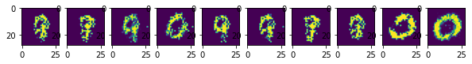
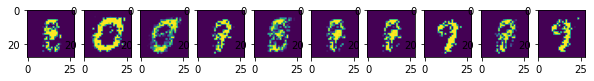

# CE-40719: Deep Learning
## HW5 - GAN (100 points)

#### Name: Amir Pourmand
#### Student No.: 99210259

### 1) Import Libraries


```python
# !pip install colabcode > /dev/null
# from colabcode import ColabCode
# ColabCode(port=10000)
import sys
```


```python
import numpy as np
import torch
import torch.nn as nn
import torch.nn.functional as F
import torch.optim as optim
from torchvision import datasets, transforms

import matplotlib.pyplot as plt
%matplotlib inline
plt.rcParams['figure.figsize'] = (10, 3) # set default size of plots
```

### 2) Loading Dataset (10 points)

In this notebook, you will use `MNIST` dataset to train your GAN. You can see more information about this dataset [here](http://yann.lecun.com/exdb/mnist/). This dataset is a 10 class dataset. It contains 60000 grayscale images (50000 for train and 10000 for test or validation) each with shape (3, 28, 28). Every image has a corresponding label which is a number in range 0 to 9.


```python
# MNIST Dataset
train_dataset = datasets.MNIST(root='./mnist/', train=True, transform=transforms.ToTensor(), download=True)
test_dataset = datasets.MNIST(root='./mnist/', train=False, transform=transforms.ToTensor(), download=True)
```

    Downloading http://yann.lecun.com/exdb/mnist/train-images-idx3-ubyte.gz
    Downloading http://yann.lecun.com/exdb/mnist/train-images-idx3-ubyte.gz to ./mnist/MNIST/raw/train-images-idx3-ubyte.gz


      0%|          | 0/9912422 [00:00<?, ?it/s]


    Extracting ./mnist/MNIST/raw/train-images-idx3-ubyte.gz to ./mnist/MNIST/raw
    
    Downloading http://yann.lecun.com/exdb/mnist/train-labels-idx1-ubyte.gz
    Downloading http://yann.lecun.com/exdb/mnist/train-labels-idx1-ubyte.gz to ./mnist/MNIST/raw/train-labels-idx1-ubyte.gz


      0%|          | 0/28881 [00:00<?, ?it/s]


    Extracting ./mnist/MNIST/raw/train-labels-idx1-ubyte.gz to ./mnist/MNIST/raw
    
    Downloading http://yann.lecun.com/exdb/mnist/t10k-images-idx3-ubyte.gz
    Downloading http://yann.lecun.com/exdb/mnist/t10k-images-idx3-ubyte.gz to ./mnist/MNIST/raw/t10k-images-idx3-ubyte.gz


      0%|          | 0/1648877 [00:00<?, ?it/s]


    Extracting ./mnist/MNIST/raw/t10k-images-idx3-ubyte.gz to ./mnist/MNIST/raw
    
    Downloading http://yann.lecun.com/exdb/mnist/t10k-labels-idx1-ubyte.gz
    Downloading http://yann.lecun.com/exdb/mnist/t10k-labels-idx1-ubyte.gz to ./mnist/MNIST/raw/t10k-labels-idx1-ubyte.gz


      0%|          | 0/4542 [00:00<?, ?it/s]


    Extracting ./mnist/MNIST/raw/t10k-labels-idx1-ubyte.gz to ./mnist/MNIST/raw
    


```python
# Device configuration
device = torch.device('cuda' if torch.cuda.is_available() else 'cpu')

################ Problem 01 (5 pts) ################
# define hyper parameters
batch_size = 64
d_lr = 1e-4
g_lr = 1e-4
n_epochs = 100
####################### End ########################
z_dim = 100
```


```python

################ Problem 02 (5 pts) ################
# Define Dataloaders
changed_dataset = torch.utils.data.TensorDataset(train_dataset.data.float()/255, train_dataset.targets)
changed_dataset = torch.utils.data.TensorDataset(test_dataset.data.float()/255, test_dataset.targets)

train_loader = torch.utils.data.DataLoader(dataset=changed_dataset, batch_size=batch_size, shuffle=True)
test_loader = torch.utils.data.DataLoader(dataset=changed_dataset, batch_size=batch_size, shuffle=False)
####################### End ########################

```

### 3) Defining Network (30 points)
At this stage, you should define a network that improves your GAN training and prevents problems such as mode collapse and vanishing gradients.


```python
class Discriminator(nn.Module):
    def __init__(self):
        super().__init__()

        self.discriminator = nn.Sequential(
            ################ Problem 03 (15 pts) ################
            # use linear or convolutional layer
            # use arbitrary techniques to stabilize training
            nn.Dropout(),
            nn.Linear(784, 256),
            nn.LeakyReLU(0.1),
            nn.Dropout(),
            nn.Linear(256, 128),
            nn.LeakyReLU(0.1),
            nn.Linear(128, 64),
            nn.Dropout(),
            nn.LeakyReLU(0.1),
            nn.Linear(64, 1),
            nn.Sigmoid()
            ####################### End ########################
        )

    def forward(self, x):
        return self.discriminator(x)


class Generator(nn.Module):
    def __init__(self):
        super().__init__()

        self.generator = nn.Sequential(
            ################ Problem 04 (15 pts) ################
            # use linear or convolutional layer
            # use arbitrary techniques to stabilize training
            nn.Linear(128, 128),
            nn.LeakyReLU(0.1),
            nn.Linear(128, 256),
            nn.LeakyReLU(0.1),
            nn.Linear(256, 512),
            nn.LeakyReLU(0.1),
            nn.Linear(512, 784),
            nn.Sigmoid()
            ####################### End ########################
        )

    def forward(self, z):
        return self.generator(z)

```

### 4) Train the Network 
At this step, you are going to train your network.


```python
################ Problem 05 (5 pts) ################
# Create instances of modules (discriminator and generator)
# don't forget to put your models on device
discriminator = Discriminator().to(device)
generator = Generator().to(device)
####################### End ########################
```


```python
################ Problem 06 (5 pts) ################
# Define two optimizer for discriminator and generator
d_optimizer = optim.Adam(discriminator.parameters(),lr=d_lr)
g_optimizer = optim.Adam(generator.parameters(),lr=g_lr)
####################### End ########################
```


```python
plot_frequency = 8

for epoch in range(n_epochs):
    for i, (images, labels) in enumerate(train_loader):
        
        ################ Problem 07 (15 pts) ################
        # put your inputs on device
        # Prepare what you need for training, like inputs for modules and variables for computing loss
        images = images.flatten(start_dim=1)

        real_img = images.to(device)

        fake_labels = torch.zeros(images.shape[0], 1).to(device)
        real_labels = torch.ones(images.shape[0], 1).to(device)
        z = torch.randn(images.shape[0], 128).to(device)

        generated_images = generator(z)

        d_optimizer.zero_grad()

        ####################### End ########################


        ################ Problem 08 (10 pts) ################
        # calculate discriminator loss and update it

        z = torch.randn(images.shape[0], 128).to(device)
        generated_images = generator(z)

        g_optimizer.zero_grad()

        d_loss = (F.binary_cross_entropy(discriminator(generated_images.detach()), fake_labels) +
                  F.binary_cross_entropy(discriminator(real_img), real_labels))
        d_loss.backward()
        d_optimizer.step()

        ####################### End ########################
        
        

        ################ Problem 09 (10 pts) ################
        # calculate generator loss and update it

        
        g_loss = F.binary_cross_entropy(discriminator(generated_images), real_labels)
        g_loss.backward()
        g_optimizer.step()


        ####################### End ########################


    ################ Problem 10 (10 pts) ################
    # plot some of the generated pictures based on plot frequency variable

    if (epoch % plot_frequency == 0):
        plt.subplots(1,10)
        for j in range(10):
            plt.subplot(1,10,j+1)
            plt.imshow(generated_images[j].detach().cpu().view(28, 28).numpy())
        plt.show()

    ####################### End ########################
    
    print("epoch: {} \t discriminator last batch loss: {} \t generator last batch loss: {}".format(epoch + 1, 
                                                                                            d_loss.item(), 
                                                                                            g_loss.item())
    )
```


    

    


    epoch: 1 	 discriminator last batch loss: 0.4526025056838989 	 generator last batch loss: 5.285737991333008
    epoch: 2 	 discriminator last batch loss: 0.43249544501304626 	 generator last batch loss: 4.652981758117676
    epoch: 3 	 discriminator last batch loss: 0.18930116295814514 	 generator last batch loss: 4.307076930999756
    epoch: 4 	 discriminator last batch loss: 0.15187987685203552 	 generator last batch loss: 3.678199291229248
    epoch: 5 	 discriminator last batch loss: 0.17373239994049072 	 generator last batch loss: 4.404343605041504
    epoch: 6 	 discriminator last batch loss: 0.32422640919685364 	 generator last batch loss: 4.331548690795898
    epoch: 7 	 discriminator last batch loss: 0.25898197293281555 	 generator last batch loss: 4.303992748260498
    epoch: 8 	 discriminator last batch loss: 0.32791081070899963 	 generator last batch loss: 4.407011032104492


    

    


    epoch: 9 	 discriminator last batch loss: 0.11968954652547836 	 generator last batch loss: 4.092791557312012
    epoch: 10 	 discriminator last batch loss: 0.3881288170814514 	 generator last batch loss: 4.699208736419678
    epoch: 11 	 discriminator last batch loss: 0.14748160541057587 	 generator last batch loss: 4.96040678024292
    epoch: 12 	 discriminator last batch loss: 0.16801181435585022 	 generator last batch loss: 5.55793571472168
    epoch: 13 	 discriminator last batch loss: 0.2709391713142395 	 generator last batch loss: 4.721650123596191
    epoch: 14 	 discriminator last batch loss: 0.0771351307630539 	 generator last batch loss: 4.4544453620910645
    epoch: 15 	 discriminator last batch loss: 0.05643106997013092 	 generator last batch loss: 4.256270885467529
    epoch: 16 	 discriminator last batch loss: 0.11224986612796783 	 generator last batch loss: 5.817045211791992


    

    


    epoch: 17 	 discriminator last batch loss: 0.07536284625530243 	 generator last batch loss: 4.191890716552734
    epoch: 18 	 discriminator last batch loss: 0.07661587744951248 	 generator last batch loss: 4.785077095031738
    epoch: 19 	 discriminator last batch loss: 0.3628731369972229 	 generator last batch loss: 5.472227096557617
    epoch: 20 	 discriminator last batch loss: 0.1707061380147934 	 generator last batch loss: 4.6116461753845215
    epoch: 21 	 discriminator last batch loss: 0.039693281054496765 	 generator last batch loss: 4.726522445678711
    epoch: 22 	 discriminator last batch loss: 0.408406138420105 	 generator last batch loss: 4.732564449310303
    epoch: 23 	 discriminator last batch loss: 0.22687120735645294 	 generator last batch loss: 4.7030439376831055
    epoch: 24 	 discriminator last batch loss: 0.19694030284881592 	 generator last batch loss: 4.343166828155518


    

    


    epoch: 25 	 discriminator last batch loss: 0.30752331018447876 	 generator last batch loss: 4.702264785766602
    epoch: 26 	 discriminator last batch loss: 0.15181729197502136 	 generator last batch loss: 6.414487361907959
    epoch: 27 	 discriminator last batch loss: 0.04409197345376015 	 generator last batch loss: 5.295083045959473
    epoch: 28 	 discriminator last batch loss: 0.08326520770788193 	 generator last batch loss: 6.03814172744751
    epoch: 29 	 discriminator last batch loss: 0.05310313403606415 	 generator last batch loss: 6.229020595550537
    epoch: 30 	 discriminator last batch loss: 0.15731941163539886 	 generator last batch loss: 5.697305202484131
    epoch: 31 	 discriminator last batch loss: 0.4631544053554535 	 generator last batch loss: 5.523553371429443
    epoch: 32 	 discriminator last batch loss: 0.2697069048881531 	 generator last batch loss: 5.838858604431152


    

    


    epoch: 33 	 discriminator last batch loss: 0.3550873100757599 	 generator last batch loss: 5.327003002166748
    epoch: 34 	 discriminator last batch loss: 0.05874096602201462 	 generator last batch loss: 5.075199127197266
    epoch: 35 	 discriminator last batch loss: 0.16970370709896088 	 generator last batch loss: 4.122466564178467
    epoch: 36 	 discriminator last batch loss: 0.1823093444108963 	 generator last batch loss: 3.6456737518310547
    epoch: 37 	 discriminator last batch loss: 0.3489549160003662 	 generator last batch loss: 4.5043535232543945
    epoch: 38 	 discriminator last batch loss: 0.26233819127082825 	 generator last batch loss: 4.710198879241943
    epoch: 39 	 discriminator last batch loss: 0.07435431331396103 	 generator last batch loss: 5.282116889953613
    epoch: 40 	 discriminator last batch loss: 0.12258202582597733 	 generator last batch loss: 5.011265277862549


    

    


    epoch: 41 	 discriminator last batch loss: 0.020369620993733406 	 generator last batch loss: 5.6662774085998535
    epoch: 42 	 discriminator last batch loss: 0.17193041741847992 	 generator last batch loss: 5.614759922027588
    epoch: 43 	 discriminator last batch loss: 0.3258708417415619 	 generator last batch loss: 4.997150421142578
    epoch: 44 	 discriminator last batch loss: 0.4404647946357727 	 generator last batch loss: 4.949891090393066
    epoch: 45 	 discriminator last batch loss: 0.07338154315948486 	 generator last batch loss: 7.295401096343994
    epoch: 46 	 discriminator last batch loss: 0.059725455939769745 	 generator last batch loss: 6.274524688720703
    epoch: 47 	 discriminator last batch loss: 0.07014722377061844 	 generator last batch loss: 6.476493835449219
    epoch: 48 	 discriminator last batch loss: 0.06962615996599197 	 generator last batch loss: 4.7340803146362305


    

    


    epoch: 49 	 discriminator last batch loss: 0.2701271176338196 	 generator last batch loss: 4.875622272491455
    epoch: 50 	 discriminator last batch loss: 0.14645716547966003 	 generator last batch loss: 4.428819179534912
    epoch: 51 	 discriminator last batch loss: 0.3282139301300049 	 generator last batch loss: 4.455596923828125
    epoch: 52 	 discriminator last batch loss: 0.08166883885860443 	 generator last batch loss: 3.972010612487793
    epoch: 53 	 discriminator last batch loss: 0.17902792990207672 	 generator last batch loss: 4.952468395233154
    epoch: 54 	 discriminator last batch loss: 0.7330385446548462 	 generator last batch loss: 4.905087471008301
    epoch: 55 	 discriminator last batch loss: 0.24163632094860077 	 generator last batch loss: 4.64194393157959
    epoch: 56 	 discriminator last batch loss: 0.07552099227905273 	 generator last batch loss: 5.131409645080566


    

    


    epoch: 57 	 discriminator last batch loss: 0.09516200423240662 	 generator last batch loss: 4.626585006713867
    epoch: 58 	 discriminator last batch loss: 0.1417853832244873 	 generator last batch loss: 4.652469635009766
    epoch: 59 	 discriminator last batch loss: 0.2954828441143036 	 generator last batch loss: 4.598642349243164
    epoch: 60 	 discriminator last batch loss: 0.07053083181381226 	 generator last batch loss: 5.158090591430664
    epoch: 61 	 discriminator last batch loss: 0.365439772605896 	 generator last batch loss: 4.7098822593688965
    epoch: 62 	 discriminator last batch loss: 0.047677841037511826 	 generator last batch loss: 3.6762924194335938
    epoch: 63 	 discriminator last batch loss: 0.19115468859672546 	 generator last batch loss: 3.902686595916748
    epoch: 64 	 discriminator last batch loss: 0.3000842034816742 	 generator last batch loss: 3.9719202518463135


    

    


    epoch: 65 	 discriminator last batch loss: 0.15772566199302673 	 generator last batch loss: 3.6041245460510254
    epoch: 66 	 discriminator last batch loss: 0.36840155720710754 	 generator last batch loss: 3.1781678199768066
    epoch: 67 	 discriminator last batch loss: 0.22352418303489685 	 generator last batch loss: 3.386303186416626
    epoch: 68 	 discriminator last batch loss: 0.28189268708229065 	 generator last batch loss: 4.055626392364502
    epoch: 69 	 discriminator last batch loss: 0.25824469327926636 	 generator last batch loss: 3.870128631591797
    epoch: 70 	 discriminator last batch loss: 0.18352827429771423 	 generator last batch loss: 3.2309844493865967
    epoch: 71 	 discriminator last batch loss: 0.3790420591831207 	 generator last batch loss: 2.6286163330078125
    epoch: 72 	 discriminator last batch loss: 0.4964669346809387 	 generator last batch loss: 3.882441997528076


    

    


    epoch: 73 	 discriminator last batch loss: 0.13859772682189941 	 generator last batch loss: 4.086652755737305
    epoch: 74 	 discriminator last batch loss: 0.0986773818731308 	 generator last batch loss: 3.3983774185180664
    epoch: 75 	 discriminator last batch loss: 0.33908355236053467 	 generator last batch loss: 2.818023681640625
    epoch: 76 	 discriminator last batch loss: 0.37425583600997925 	 generator last batch loss: 3.000114917755127
    epoch: 77 	 discriminator last batch loss: 0.36668747663497925 	 generator last batch loss: 3.1483631134033203
    epoch: 78 	 discriminator last batch loss: 0.15351355075836182 	 generator last batch loss: 3.4849298000335693
    epoch: 79 	 discriminator last batch loss: 0.16643989086151123 	 generator last batch loss: 3.6033639907836914
    epoch: 80 	 discriminator last batch loss: 0.4028579294681549 	 generator last batch loss: 3.202993392944336


    

    


    epoch: 81 	 discriminator last batch loss: 0.34524911642074585 	 generator last batch loss: 2.919123649597168
    epoch: 82 	 discriminator last batch loss: 0.35261666774749756 	 generator last batch loss: 3.1046531200408936
    epoch: 83 	 discriminator last batch loss: 0.10104389488697052 	 generator last batch loss: 3.797217845916748
    epoch: 84 	 discriminator last batch loss: 0.2141474187374115 	 generator last batch loss: 3.434494733810425
    epoch: 85 	 discriminator last batch loss: 0.8162918090820312 	 generator last batch loss: 2.8962299823760986
    epoch: 86 	 discriminator last batch loss: 0.36329665780067444 	 generator last batch loss: 2.8522610664367676
    epoch: 87 	 discriminator last batch loss: 0.5243480205535889 	 generator last batch loss: 3.0861964225769043
    epoch: 88 	 discriminator last batch loss: 0.31290438771247864 	 generator last batch loss: 3.705423355102539


    

    


    epoch: 89 	 discriminator last batch loss: 0.31781554222106934 	 generator last batch loss: 2.8093068599700928
    epoch: 90 	 discriminator last batch loss: 0.47039374709129333 	 generator last batch loss: 2.781459093093872
    epoch: 91 	 discriminator last batch loss: 0.31486403942108154 	 generator last batch loss: 3.0602493286132812
    epoch: 92 	 discriminator last batch loss: 0.4269317388534546 	 generator last batch loss: 3.008514881134033
    epoch: 93 	 discriminator last batch loss: 0.26753953099250793 	 generator last batch loss: 2.7242507934570312
    epoch: 94 	 discriminator last batch loss: 0.34563255310058594 	 generator last batch loss: 2.4893853664398193
    epoch: 95 	 discriminator last batch loss: 0.4548366665840149 	 generator last batch loss: 2.9345273971557617
    epoch: 96 	 discriminator last batch loss: 0.47257599234580994 	 generator last batch loss: 3.058396577835083


    

    


    epoch: 97 	 discriminator last batch loss: 0.12716469168663025 	 generator last batch loss: 2.4509408473968506
    epoch: 98 	 discriminator last batch loss: 0.32557404041290283 	 generator last batch loss: 3.260545253753662
    epoch: 99 	 discriminator last batch loss: 0.30183959007263184 	 generator last batch loss: 3.4616000652313232
    epoch: 100 	 discriminator last batch loss: 0.4865638017654419 	 generator last batch loss: 2.9558064937591553


### 5) Save Generator
Save your final generator parameters. Upload it with your other files.


```python
################ Problem 11 (5 pts) ################
# save state dict of your generator
path = "/content/my_parameters"
torch.save(generator.state_dict(), path)
####################### End ########################
```


```python

```
